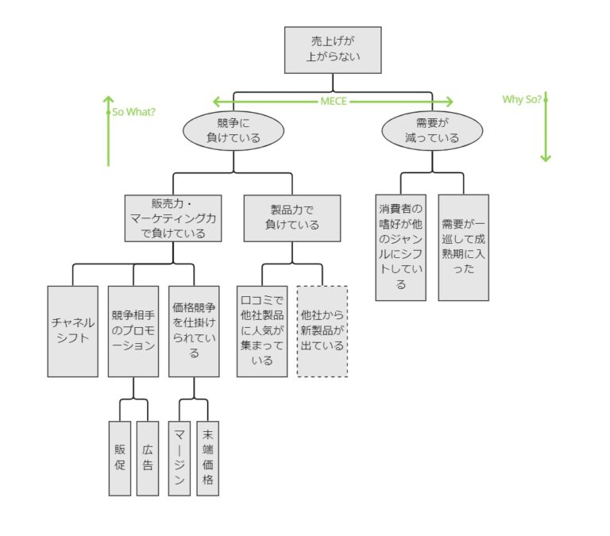

# 記事の内容
本記事では、よい仮説の条件と、仮説を立てるための思考法についてを解説します。

# 良い仮説の条件
良い仮説は以下の3つの条件を満たしています。

+ 一段深く掘り下げたものである
+ 具体的なアクションに結びつく
+ 答えが出せる

## 一段深く掘り下げたものである
よい仮説は、一段深く掘り下げたものである必要があります。

例えば、「営業成績が上がらないのはなぜか」という問いを考えます。「教育が十分でないからだ」という仮説では掘り下げ方が浅く、仮説が実証されても「教育に力を入れる」という漠然としたの結論になりかねません。

一方で、「教育担当者が自身の営業活動に忙殺され、若手の指導や同行セールスができていないからだ」という仮説であれば、仮説が実証された際により本質的な原因にたどり着くことができます。

## 具体的なアクションに結びつく
よい仮説は、仮説が実証された際に具体的なアクションに結びつく必要があります。

前述の例の、「教育が十分でないからだ」という仮説では、具体的なアクションに結びつきにくく感じます。

一方で、「教育担当者が自身の営業活動に忙殺され、若手の指導や同行セールスができていないからだ」という仮説では、実証された際に「営業活動のノルマを減らして、若手の指導に注力する」といったような具体的なアクションに結びつきやすくなります。

## 答えが出せる
よい仮説は、一段深く掘り下げたもの、具体的なアクションに結びつくことに加えて、答えが出せる必要があります。既存の技術では答えが出せない、あるいは出せたとしても相当のコストがかかってしまう仮説は、検証に労力がかかるだけでよい仮説とは言えません。

例えば、ビックデータを分析することで仮説を検証できる場合でも、膨大な計算コストが必要となる場合は分析によって得られるリターンがコストに見合わないかもしれません。

# 仮説を立てるための思考法
仮説を思いつく瞬間には、ディスカッション、インタビュー、突然ひらめく、じっくり考えているときなどがあり、仮説の立て方に定石はありません。

ここでは、新しい仮説が生み出しやすくなる思考法を3つ紹介します。

+ 複数の視点から見る
+ 両極端に振って考える
+ ゼロベースで考える

## 複数の視点から見る
異なる視点から見ると同じものでも違って見えます。視点を変えることで、新しい発想が浮かぶ可能性も高くなります。代表的なものとしてユーザーの視点、現場の視点、競合の視点の3つを取り上げます。

①ユーザーの視点  
ユーザーの視点から商品を見るのはとても有効です。ユーザーは誰で、どこで、なぜ自社の商品を購入しているのか、それによってどのような体験を得ているのか考えてみましょう。

例えば、JR東日本のSuicaとNTTのICテレフォンカードはともにICカードですが、前者は全国的に普及したのに対して、後者はほとんど普及しませんでした。ユーザー視点で見るとこの違いが明確になります。

JR東日本のSuicaは従来の磁気式イオカードと比較して、追加でチャージできる、定期券と併用できる、定期をなくしても再発行してもらえるなど明確な利便性があります。

それに対して、NTTのICテレフォンカードは従来の磁気式テレフォンカードと比較してなんのメリットもない上に使える電話機が限定されていました。

②現場の視点  
机上で考えるだけでなく、実際に現場に行くことで見えてくるものもあります。

ある企業の本社の社員は、自分たちが考えたことを現場が実行してくれないため、業績が上がらないと嘆いていました。

一方で、現場の社員は、本社から毎日のように多くの指示が降ってきて業務が増えるばかりで、一向に業績が上がらないと感じていました。

この企業の場合は、本社の施策を上から下に降ろす形ではなく、本社の業務を現場に役立つことのみに絞り込んで現場からの報告は最低限に抑えることで、業績が大幅に改善しました。

③競合の視点  
競合企業の社員の視点から、自社を見てみるのも有効です。

自社では当たり前と思っているものでも、競争相手からは羨ましい経営資源に見えるものがあるかもしれません。そのような経営資源に立脚して戦略を考えることで、競争で優位に立ち回れる可能性もあります。

## 両極端に振って考える
重要な要素を絞り込む際には、両極端に振って考えるのが有効です。

例えば、自社製品の機能、価格、ブランドなどが極端に変わった場合にユーザーがどう反応するのか思考実験することで、ユーザーが何を重視しているのかが見えてきます。

## ゼロベースで考える
思考の幅を広げるためには、既存の枠組みにとらわれず、目的に対して白紙の段階からゼロベースで考える姿勢が大切です。

例えば、目標が「コールセンターの人数を二割削減（100人→80人）する」だと、施策として「仕事をマニュアル化して効率化する」、「クレームがかかってくる時間を分析して社員数を最適化する」、「仕事を外注化する」などのアイデアが思いつきます。

一方で、目標が「コールセンターの人数を5人にする」だと、施策として「生産管理や品質管理を徹底する」、「取扱説明書をわかりやすく作り直す」など、より本質的なアイデアが思いつくかもしれません。

# 仮説の質を上げる
仮説の質を上げるため、仮説を深掘りする手法としてイシュー・ツリーがあります。

イシュー・ツリーでは、以下の図のように仮説をノードとしたツリー構造の絵によって仮説を構造化します。仮説を深掘りしていく際は、MECE（もれなくダブりなく）に分解できているか、So What? / Why So?の関係になっているか注意します。

# まとめ
よい仮説の3つの条件と、仮説を立てるための3つの思考法について解説しました。

仮説の立て方に定石はありませんが、仮説を立てるための3つの思考法を用いることでより良い仮説を立てることができるでしょう。

# 参考資料
1. イシューからはじめよー知的生産の「シンプルな本質」 安宅和人 英治出版
1. 仮説思考 BCG流 問題発見・解決の発想法 内田和成 東洋経済新報社