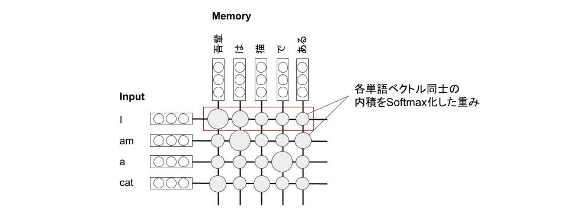

# Attentionとは
Attentionは機械翻訳や画像処理等に利用され、ニューラルネットワーク内に挿入することで、どこに注意を向けるかを決定する重みを学習できる。学習後の重みを取り出すとモデルがどこに注意を向けているのか可視化できる。Attentionを用いると各単語間の関連を表現できる。

例）Attentionを用いた機会翻訳での単語間の関連

# シンプルなAttention
Attentionでは、どこに注意を向けるか重み付けを行う必要があり、InputとMemoryの各単語同士の内積を取ることで重みを計算する（内積注意[^1]）。

[^1]: 内積注意の他にも、FFNを通して重みを計算する加法注意と呼ばれる手法もあるが、処理速度の観点から内積注意が用いられる。

計算した重みをMemoryにかけて加重和をとり、Memoryを考慮したInputを再定義する。

上記をまとめると以下のようになる。

# Source-Target Attention
Source-target attentionではMemoryをKeyとValueを分けることでモデルの表現力を上げる。

# Self-Attention
Self-AttentionではInput (Query) と Memory (Key, Value) がすべて同じものを使用する。

# Scaled Dot-Product Attention
内積注意の代わりに縮小付き内積注意を用いたもの。縮小付き内積注意では重みをスケーリング因子√(dk)で除算することで、逆伝播の勾配が小さくなることを防ぐ。

# Multi-Head Attention
複数のAttentionを並列に並べたもの。アンサンブル学習により精度が向上する。

# Masked Multi-Head Attention
Multi-Head Attentionの各AttentionにMaskを追加したもの。

Maskを追加することで、予測ターゲットの情報がリークすることを防ぐことができる。

