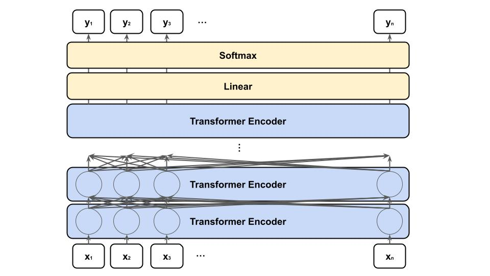

# BERTとは
TransformerのEncoder部分を複数重ねたモデル。



BERTでは、事前学習とファインチューニングのニ段階の学習が必要になる。
まず、事前学習で、膨大な数の教師なし文章を用いて一般的な文章を理解するモデルを作成する。その後、ファインチューニングで、少量の教師ありデータを用いて各タスクに特化した予測モデルを作成する。

事前学習では、膨大な数のラベルなし文章データを用いて、以下の2つの偽のタスクを解く。

+ MLM(Masked Language Model)  
    ランダムにマスクされた文章から、もとの文章を予測するタスク。  
    15%のトークンが予測対象のトークンとしてランダムに選ばれ、内80%は[MASK]トークンに、10%はランダムな単語に置き換えられ、10%がオリジナルの単語のままとして扱われる。

    Original
    ```
    Thank you for inviting me to your party last week
    ```

    Inputs
    ```
    Thank you for [MASK] me to your party [MASK] week
    ```

    Targets
    ```
    Thank you for inviting me to your party last week
    ```

+ NSP(Next Sentence Prediction)  
    文章のペアを受け取り、それらが連続した文章かどうかを判定するタスク。  
    50%は連続したもの、残りの50%はランダムに選ばれたものが文章のペアとして与えられる。


ファインチューニングでは、最終層の後ろに1層追加して真のタスクを解く。これにより、少量の教師ありデータを用意するだけで精度の高いモデルが得られる。

