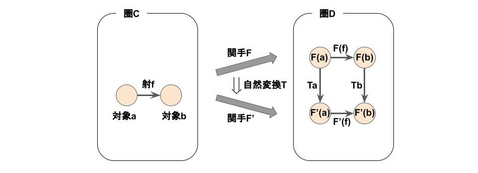
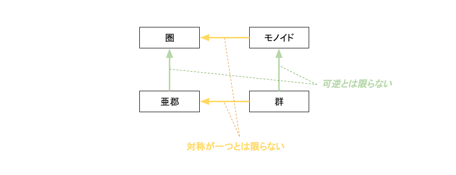

# 圏論とは
数学的構造を抽象的に扱う数学の一分野。「圏」「関手」「自然変換」を基本概念として持ち、これらを用いて数学的構造を記述する。

+ 圏  
    対象と射から構成される構造。

+ 関手  
    圏を対象としたときの射。圏の構造を維持したまま別の圏に変換する。

+ 自然変換  
    関手を対象としたときの射。関手の性質を維持したまま別の関手に変換する。

# 圏と群の関係

