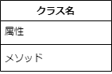
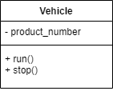
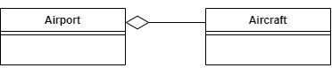
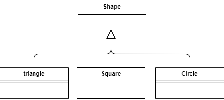
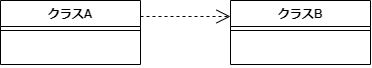

# クラス図とは
UML（Unified Modeling Language: 統一モデリング言語）の代表的な図の一つ。
クラス図では、クラスと関連を用いてクラス間の依存関係を視覚的に表現できる。

# クラスの表記
クラスは、3つの区画に分割された長方形で表記する。3つの区画には上から順にクラス名、属性、メソッドが記載される。

属性やメソッドのアクセス可能性は、+、#、－といった記号を各属性やメソッドの前に記載することで表現する。

|記号|アクセス可能性|意味|
|---|---|---|
|+|public|すべてのオブジェクトからアクセス可能。|
|#|protected|自クラスと派生クラスからのみアクセス可能。|
|-|private|自クラスからのみアクセス可能。|

例えば、属性として製品番号、メソッドとしてrunとstopをもつVehicleクラスは次のように表記できる。

# 関連の表記
クラス同士の関連としてよく使われるものに、集約、コンポジション、継承、依存があり、それぞれ以下のように表記する。

+ 集約
AはBを保持している（has-a 関係）

例）空港は航空機を保持している

+ コンポジション
AはBによって構成されている（has-a 関係）

（例）タイヤは車の一部である

+ 継承
AはBの一種である（is-a 関係）

例）三角、四角、丸は図形の一種である

+ 依存
AはBを使用している（uses-a 関係）

例）人が電話を使用している

