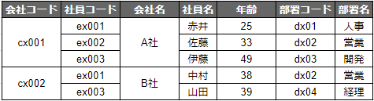

# データベースの正規化とは
データの更新効率を低下させるデータの重複（冗長性）や更新処理のタイムラグなどで生じるデータの不整合（非一貫性）といった問題を解決するために、データテーブルを整理、分割すること。第一正規化から第五正規化まである。

正規化を進めていくとテーブル数が増えるため、情報を取り出す際にテーブル結合が必要になり、パフォーマンスが低下する。原則、第３正規化まで実施するが、パフォーマンス改善のためにあえて非正規化することもある。

# 非正規系
次のような非正規系の表を考える。

■ 社員テーブル



# 第一正規化
第一正規化では、一つのセルに一つの値しか含まない状態（第一正規形）にテーブルを変形する。

■ 社員テーブル
|会社コード(pk)|社員コード(pk)|会社名|社員名|年齢|部署コード|部署名|
|---|---|---|---|---|---|---|
|c001|e001|A社|赤井|25|d001|人事|
|c001|e002|A社|佐藤|33|d002|営業|
|c001|e003|A社|伊藤|49|d003|開発|
|c002|e001|B社|中村|38|d002|営業|
|c002|e002|B社|山田|39|d004|経理|


# 第二正規化
第二正規化では、部分関数従属性を解消するようにテーブルを分割する。部分関数従属とは、複合主キーの一部によって他の項目が一意に定まること。

社員テーブルでは、「会社名」以外は複合主キー（{会社コード, 社員コード}）に従属しているが、「会社名」は「会社コード」のみに従属している。そこで、この部分関数従属性を解消するため、次のようにテーブルを分割する。

■社員テーブル  
|会社コード(pk)|社員コード(pk)|社員名|年齢|部署コード|部署名|
|---|---|---|---|---|---|
|c001|e001|赤井|25|d001|人事|
|c001|e002|佐藤|33|d002|営業|
|c001|e003|伊藤|49|d003|開発|
|c002|e001|中村|38|d002|営業|
|c002|e002|山田|39|d004|経理|

■会社テーブル  
|会社コード(pk)|会社名|
|---|---|
|c001|A社|
|c002|B社|

これによって、社員情報が不明の会社もテーブルに追加できるようになる。

■会社テーブル（社員情報が不明の会社を追加）  
|会社コード(pk)|会社名|
|---|---|
|c001|A社|
|c002|B社|
|c003|C社|


# 第三正規化
第三正規化では、推移的関数従属性を解消するようにテーブルを分割する。推移的関数従属とは、段階的な関数従属があること。

社員テーブルでは、「部署名」は「部署コード」に従属していて、「部署コード」は「社員コード」に従属している。つまり、全体としては次のような推移的関数従属がある。

```
{社員コード} → {部署コード} → {部署名}
```

そこで、この推移的関数従属性を解消するため、次のようにテーブルを分割する。

■社員テーブル  
|会社コード(pk)|社員コード(pk)|社員名|年齢|部署コード|
|---|---|---|---|---|
|c001|e001|赤井|25|d001|
|c001|e002|佐藤|33|d002|
|c001|e003|伊藤|49|d003|
|c002|e001|中村|38|d002|
|c002|e002|山田|39|d004|

■会社テーブル 
|会社コード(pk)|会社名|
|---|---|
|c001|A社|
|c002|B社|
|c003|C社|

■部署
|部署コード(pk)|部署名|
|---|---|
|d001|人事|
|d002|営業|
|d003|開発|
|d004|経理|

これによって、社員情報が不明の部署もテーブルに追加できるようになる。

■部署（社員情報が不明の部署を追加）
|部署コード(pk)|部署名|
|---|---|
|d001|人事|
|d002|営業|
|d003|開発|
|d004|経理|
|d005|製造|


# ボイスコッド正規化
ボイスコッド正規化では、自明でない関数従属性を解消するようにテーブルを分割する。ボイスコット正規形は3.5正規形と呼ばれることもある。

例として、次のようなテーブルを考える。

■社員-チーム-チーム補佐
|社員コード(pk)|チームコード(pk)|チーム補佐コード|
|---|---|---|
|e001|t001|a001|
|e002|t001|a002|
|e003|t001|a001|
|e004|t002|a003|
|e005|t002|a003|

ここでは、チーム補佐は同じチームに複数いることもあるが、一人が複数のチームを兼任することはできないという業務ルールが存在すると仮定する。つまり、「チームコード」は「チーム補佐コード」に従属している。

```
{チーム補佐コード} → {チームコード}
```

このテーブルは、部分関数従属や推移的関数従属がないため第三正規形ではあるが、「非キーからキーへの関数従属」があるためボイスコッド正規形ではない。そこで、この「非キーからキーへの関数従属」を解消するため、次のようにテーブルを分割する。この分解は可逆的な分解になるように注意する。

■社員-チーム
|社員コード(pk)|チーム補佐コード(pk)|
|---|---|
|e001|a001|
|e002|a002|
|e003|a001|
|e004|a003|
|e005|a003|

■チーム補佐-チーム
|チーム補佐コード(pk)|チームコード|
|---|---|
|a001|t001|
|a002|t001|
|a003|t002|


# 第四正規化
第四正規化では、複数の多値従属性を解消するようにテーブルを分割する。多値従属とはキーに対して値の集合が対応があること。

例として、次のようなテーブルを考える。

■社員-チーム-チーム補佐
|社員コード(pk)|チームコード(pk)|製品コード(pk)|
|---|---|---|
|e001|t001|P1|
|e001|t001|P2|
|e002|t001|P1|
|e002|t002|P1|
|e003|t002|P2|

「社員コード」から「チームコード」と「製品コード」に多値従属性がある。

```
{社員コード} → {チームコード}
{社員コード} → {製品コード}
```

そこで、この複数の多値従属性を解消するため、次のようにテーブルを分割する。

■社員-チーム
|社員コード(pk)|チームコード(pk)|
|---|---|
|e001|t001|
|e002|t001|
|e002|t002|
|e003|t002|

■社員-製品
|社員コード(pk)|製品コード(pk)|
|---|---|
|e001|P1|
|e001|P2|
|e002|P1|
|e003|P2|


# 第五正規化
第五正規化では、結合従属性を解消するようにテーブルを分割する。

前述の「社員-チーム-チーム補佐」テーブルに、「社員コード」から「チームコード」と「製品コード」に多値従属性に加え、「チームコード」から「製品コード」に多値従属性がある場合を考える。

```
{社員コード} → {チームコード}
{社員コード} → {製品コード}
{チームコード} → {製品コード}
```

この場合、次のようにテーブルを分割する。

■社員-チーム
|社員コード(pk)|チームコード(pk)|
|---|---|
|e001|t001|
|e002|t001|
|e002|t002|
|e003|t002|

■社員-製品
|社員コード(pk)|製品コード(pk)|
|---|---|
|e001|P1|
|e001|P2|
|e002|P1|
|e003|P2|

■チーム-製品
|チームコード(pk)|製品コード(pk)|
|---|---|
|t001|P1|
|t001|P2|
|t001|P1|
|t002|P1|
|t002|P2|


# 参考資料
- 達人に学ぶDB設計徹底指南書, ミック