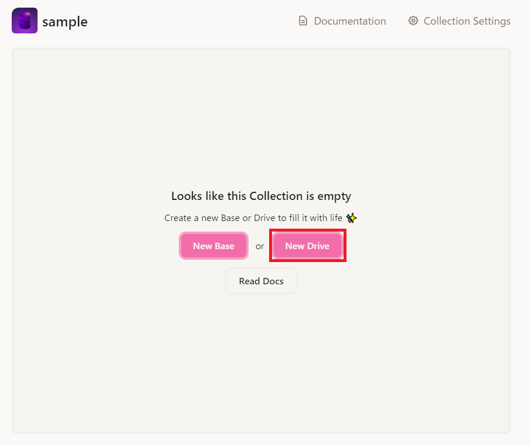
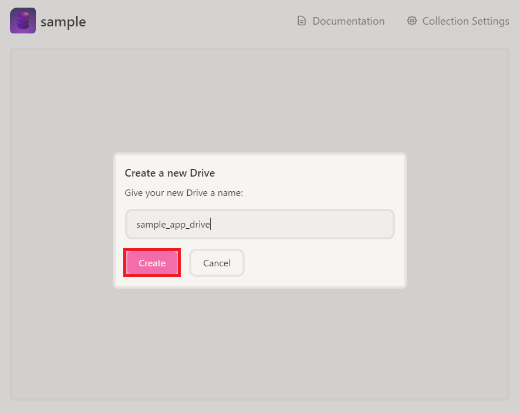
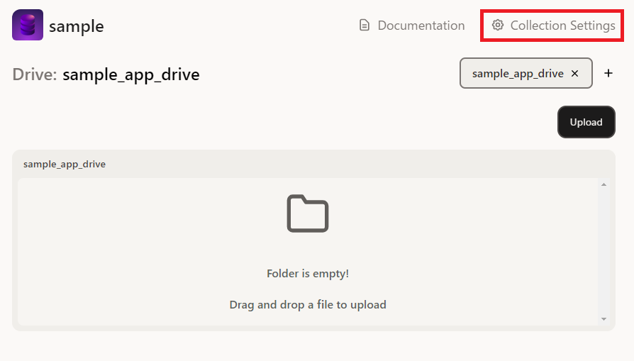
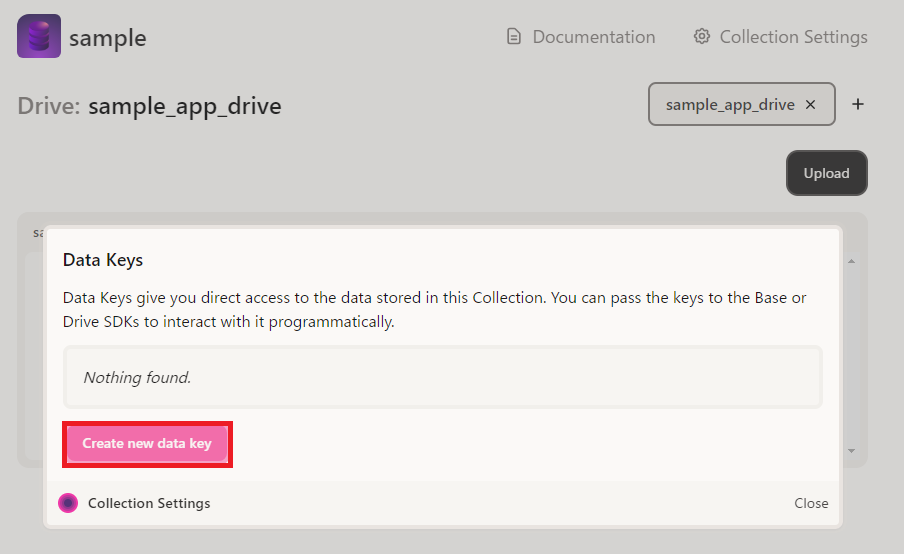
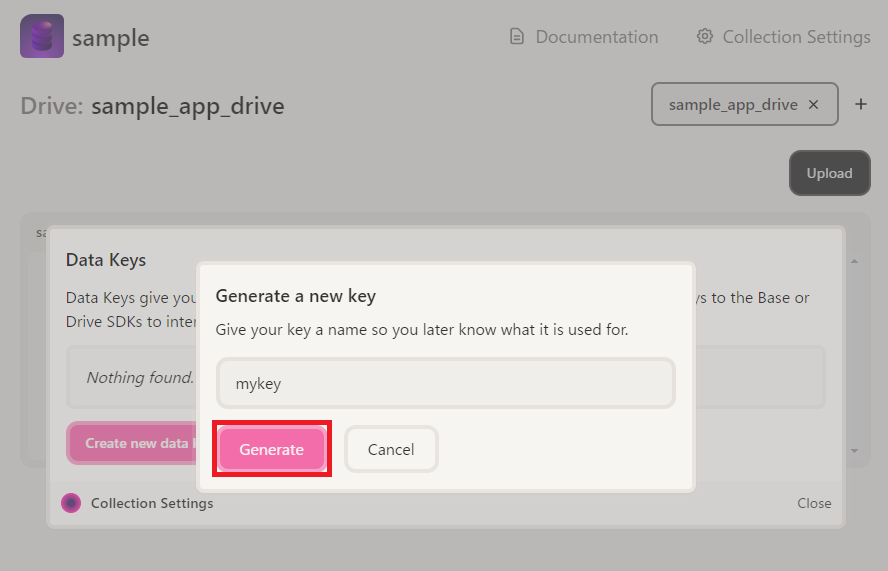
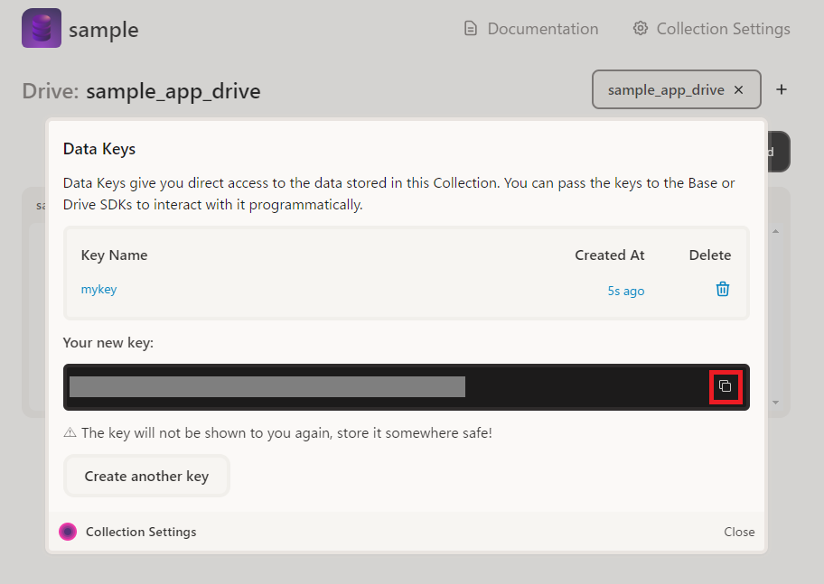

# Deta SpaceでSqliteを利用するための手順
FastAPI+SQLiteで作ったアプリをData Spaceに無料でサクッとデプロイするための手順を以下に示す。本記事では、Deta Spaceが現在（2023年6月18日時点）対応しているPythonバージョン 3.9を想定。

1. Deta Collectionを新規作成する

2. Collectionの中に「sample_app_drive」という名前でDriveを新規作成する

「New Drive」をクリック


「sample_app_drive」と入力して「Create」をクリック


3. Collection Settingsからコレクションのデータキーを作成する

「Collection Settings」をクリック


「Create new data key」をクリック


任意の名前を入力して「Generate」をクリック


データキーが表示されるのでコピーしておく


4. 以下の構成でファイルを作成する

.  
├── crud.py  
├── database.py  
├── main.py  
├── models.py  
├── schemas.py  
├── Deta_Drive_Database_api.py  
└── requirements.txt  

```python:title=database.py
from sqlalchemy import create_engine, event
from sqlalchemy.orm import sessionmaker
from Deta_Drive_Database_api import DetaDriveDatabase
from sqlalchemy.ext.declarative import declarative_base


deta_project_key = "<コレクションのデータキー>"
drive_name = "sample_app_drive"
db_name = "sample_app.db"
SQLALCHEMY_DATABASE_URL = 'sqlite:///:memory:'

db_deta = DetaDriveDatabase(deta_project_key, drive_name, db_name)

engine = create_engine(
    SQLALCHEMY_DATABASE_URL, connect_args={'check_same_thread': False}
)

@event.listens_for(engine, 'connect')
def connect(dbapi_connection, connection_record):
    db_deta.load_db_to_memory(dbapi_connection)

@event.listens_for(engine, 'commit')
def commit(dbapi_connection):
    db_deta.save_memory_to_drive(dbapi_connection.connection)

SessionLocal = sessionmaker(bind=engine, autocommit=False, autoflush=False)
Base = declarative_base()

def get_db():
    db = SessionLocal()
    try:
        yield db
    finally:
        db.close()
```
※ <コレクションのデータキー>の部分は各自のデータキーに置き換える

Copyright (c) 2023 Ahmad Fijr  
Released under the MIT license  
[https://opensource.org/licenses/mit-license.php](https://opensource.org/licenses/mit-license.php)

```python:title=models.py
from sqlalchemy import Boolean, Column, ForeignKey, Integer, String
from sqlalchemy.orm import relationship

from database import Base


class User(Base):
    __tablename__ = "users"

    id = Column(Integer, primary_key=True, index=True)
    email = Column(String, unique=True, index=True)
    hashed_password = Column(String)
    is_active = Column(Boolean, default=True)

    items = relationship("Item", back_populates="owner")


class Item(Base):
    __tablename__ = "items"

    id = Column(Integer, primary_key=True, index=True)
    title = Column(String, index=True)
    description = Column(String, index=True)
    owner_id = Column(Integer, ForeignKey("users.id"))

    owner = relationship("User", back_populates="items")
```

Copyright (c) 2018 Sebastián Ramírez  
Released under the MIT license  
[https://opensource.org/licenses/mit-license.php](https://opensource.org/licenses/mit-license.php)

```python:title=schemas.py
from typing import Union

from pydantic import BaseModel


class ItemBase(BaseModel):
    title: str
    description: Union[str, None] = None


class ItemCreate(ItemBase):
    pass


class Item(ItemBase):
    id: int
    owner_id: int

    class Config:
        orm_mode = True


class UserBase(BaseModel):
    email: str


class UserCreate(UserBase):
    password: str


class User(UserBase):
    id: int
    is_active: bool
    items: list[Item] = []

    class Config:
        orm_mode = True
```

Copyright (c) 2018 Sebastián Ramírez  
Released under the MIT license  
[https://opensource.org/licenses/mit-license.php](https://opensource.org/licenses/mit-license.php)

```python:title=crud.py
from sqlalchemy.orm import Session

import models, schemas


def get_user(db: Session, user_id: int):
    return db.query(models.User).filter(models.User.id == user_id).first()


def get_user_by_email(db: Session, email: str):
    return db.query(models.User).filter(models.User.email == email).first()


def get_users(db: Session, skip: int = 0, limit: int = 100):
    return db.query(models.User).offset(skip).limit(limit).all()


def create_user(db: Session, user: schemas.UserCreate):
    fake_hashed_password = user.password + "notreallyhashed"
    db_user = models.User(email=user.email, hashed_password=fake_hashed_password)
    db.add(db_user)
    db.commit()
    db.refresh(db_user)
    return db_user


def get_items(db: Session, skip: int = 0, limit: int = 100):
    return db.query(models.Item).offset(skip).limit(limit).all()


def create_user_item(db: Session, item: schemas.ItemCreate, user_id: int):
    db_item = models.Item(**item.dict(), owner_id=user_id)
    db.add(db_item)
    db.commit()
    db.refresh(db_item)
    return db_item
```

Copyright (c) 2018 Sebastián Ramírez  
Released under the MIT license  
[https://opensource.org/licenses/mit-license.php](https://opensource.org/licenses/mit-license.php)

```python:title=main.py
from fastapi import Depends, FastAPI, HTTPException
from fastapi.middleware.cors import CORSMiddleware
from sqlalchemy.orm import Session

import crud, models, schemas
from database import SessionLocal, engine, get_db

models.Base.metadata.create_all(bind=engine)

app = FastAPI()

origins = [
    "http://localhost.tiangolo.com",
    "https://localhost.tiangolo.com",
    "http://localhost",
    "http://localhost:8080",
]

app.add_middleware(
    CORSMiddleware,
    allow_origins=origins,
    allow_credentials=True,
    allow_methods=["*"],
    allow_headers=["*"],
)

@app.post("/users/", response_model=schemas.User)
def create_user(user: schemas.UserCreate, db: Session = Depends(get_db)):
    db_user = crud.get_user_by_email(db, email=user.email)
    if db_user:
        raise HTTPException(status_code=400, detail="Email already registered")
    return crud.create_user(db=db, user=user)


@app.get("/users/", response_model=list[schemas.User])
def read_users(skip: int = 0, limit: int = 100, db: Session = Depends(get_db)):
    users = crud.get_users(db, skip=skip, limit=limit)
    return users


@app.get("/users/{user_id}", response_model=schemas.User)
def read_user(user_id: int, db: Session = Depends(get_db)):
    db_user = crud.get_user(db, user_id=user_id)
    if db_user is None:
        raise HTTPException(status_code=404, detail="User not found")
    return db_user


@app.post("/users/{user_id}/items/", response_model=schemas.Item)
def create_item_for_user(
    user_id: int, item: schemas.ItemCreate, db: Session = Depends(get_db)
):
    return crud.create_user_item(db=db, item=item, user_id=user_id)


@app.get("/items/", response_model=list[schemas.Item])
def read_items(skip: int = 0, limit: int = 100, db: Session = Depends(get_db)):
    items = crud.get_items(db, skip=skip, limit=limit)
    return items
```

Copyright (c) 2018 Sebastián Ramírez  
Released under the MIT license  
[https://opensource.org/licenses/mit-license.php](https://opensource.org/licenses/mit-license.php)

```python:title=Deta_Drive_Database_api.py
import io
import random
from deta import Deta
import sqlite3

class DetaDriveDatabase:
    def __init__(self, deta_project_key, drive_name, db_name):
        # Initialize the Deta library with the provided project key
        self.deta = Deta(deta_project_key)
        # Get a reference to the specified Deta Drive
        self.drive = self.deta.Drive(drive_name)
        # Store the database name for later use
        self.db_name = db_name
        # Initialize the database connection and cursor to None
        self.conn = None
        self.cursor = None

    def connect(self):
        # Check if the database file exists on Deta Drive
        db_file = self.drive.get(self.db_name)

        try:
            db_read = db_file.read()
        except AttributeError:
            db_read = None
        
            
        if db_read == None or 0 == len(db_read):
            # Create a new empty in-memory SQLite database
            conn = sqlite3.connect(":memory:")
            # Dump the contents of the in-memory database to a new BytesIO object
            db_file_new = io.BytesIO()
            for line in conn.iterdump():
                db_file_new.write(f"{line}\n".encode("utf-8"))
            db_file_new.seek(0)
            # Upload the new database file to Deta Drive
            self.drive.put(self.db_name, db_file_new)
            db_file = self.drive.get(self.db_name)
            
            if db_read == None:
                print(f"The database file `{self.db_name}` does not exist in the Deta drive, create a new one")
                db_read = db_file.read()
            

        # Read the database file from Deta Drive as bytes
        db_bytes = db_read
        db_file = io.BytesIO(db_bytes)

        # Create an in-memory SQLite database
        self.conn = sqlite3.connect(":memory:")
        self.cursor = self.conn.cursor()

        # Load the contents of the db_file object into the in-memory database
        self.conn.executescript(db_file.getvalue().decode("utf-8"))

    def close(self):
        # Dump the contents of the in-memory database to a new BytesIO object
        db_file_new = io.BytesIO()
        for line in self.conn.iterdump():
            db_file_new.write(f"{line}\n".encode("utf-8"))

        # Upload the updated database file to Deta Drive
        db_file_new.seek(0)
        self.drive.put(self.db_name, db_file_new)

        # Close the database connection and set it to None
        self.conn.close()
        self.conn = None

    def save(self):
        
        if not self.conn:
            raise Exception("Database is not connected. Please call the connect method first.")


        # Dump the contents of the in-memory database to a new BytesIO object
        db_file_new = io.BytesIO()
        for line in self.conn.iterdump():
            db_file_new.write(f"{line}\n".encode("utf-8"))

        # Upload the updated database file to Deta Drive
        db_file_new.seek(0)
        self.drive.put(self.db_name, db_file_new)
    
    def load_db_to_memory(self, dbapi_con):
        # Load the database from Deta Drive
        data = self.drive.get(self.db_name)
        if data:
            # Load the database into memory
            dbapi_con.executescript(data.read().decode())

    def save_memory_to_drive(self, dbapi_con):
        # Save the in-memory database to a file
        script = "".join(dbapi_con.iterdump())
        # Save the file to your Deta Drive
        self.drive.put(self.db_name, script.encode())
    
    def delete_database(self):
        # Check if the database is connected
        if not self.conn:
            raise Exception("Database is not connected. Please call the connect method first.")
        
        # Close the database connection and set it to None
        self.conn.close()
        self.conn = None
        
        # Delete the database file from Deta Drive
        self.drive.delete(self.db_name)
        
    def clear_table(self, table_name):
        # Check if the database is connected
        if not self.conn:
            raise Exception("Database is not connected. Please call the connect method first.")
        
        # Execute the DELETE FROM SQL statement to delete all rows from the table
        self.cursor.execute(f"DELETE FROM {table_name}")
        
    def clear_database(self):
        # Check if the database is connected
        if not self.conn:
            raise Exception("Database is not connected. Please call the connect method first.")
        
        # Get a list of all tables in the database
        self.cursor.execute("SELECT name FROM sqlite_master WHERE type='table'")
        tables = [row[0] for row in self.cursor.fetchall()]
        
        # Truncate each table
        for table in tables:
            self.truncate_table(table)
        
    def create_table(self, table_name, columns):
        # Check if the database is connected
        if not self.conn:
            raise Exception("Database is not connected. Please call the connect method first.")
        
        # Create a string representation of the columns and their data types
        columns_str = ", ".join([f"{name} {data_type}" for name, data_type in columns.items()])
        # Execute the CREATE TABLE SQL statement
        self.cursor.execute(f"CREATE TABLE IF NOT EXISTS {table_name} ({columns_str})")

    def drop_table(self, table_name):
        # Check if the database is connected
        if not self.conn:
            raise Exception("Database is not connected. Please call the connect method first.")
        
        # Execute the DROP TABLE SQL statement
        self.cursor.execute(f"DROP TABLE IF EXISTS {table_name}")

    def rename_table(self, old_table_name, new_table_name):
        # Check if the database is connected
        if not self.conn:
            raise Exception("Database is not connected. Please call the connect method first.")
        
        # Execute the ALTER TABLE RENAME TO SQL statement
        self.cursor.execute(f"ALTER TABLE {old_table_name} RENAME TO {new_table_name}")

    def insert_data(self, table_name, columns, values):
        # Check if the database is connected
        if not self.conn:
            raise Exception("Database is not connected. Please call the connect method first.")
        
        # Create a string representation of the columns and placeholders for the values
        columns_str = ", ".join(columns)
        placeholders = ", ".join(["?" for _ in columns])
        query = f"INSERT INTO {table_name} ({columns_str}) VALUES ({placeholders})"
        # Execute the INSERT INTO SQL statement for each set of values
        self.cursor.executemany(query, values)

    def update_data(self, table_name, set_values, where_condition):
        # Check if the database is connected
        if not self.conn:
            raise Exception("Database is not connected. Please call the connect method first.")
        
        # Create a string representation of the SET clause
        set_values_str = ", ".join([f"{column} = ?" for column in set_values.keys()])
        # Create a string representation of the WHERE clause
        where_condition_str = " AND ".join([f"{column} = ?" for column in where_condition.keys()])
        # Combine the values from the SET and WHERE clauses into a single list
        values = list(set_values.values()) + list(where_condition.values())
        # Execute the UPDATE SQL statement
        self.cursor.execute(f"UPDATE {table_name} SET {set_values_str} WHERE {where_condition_str}", values)

    def delete_data(self, table_name, where_condition):
        # Check if the database is connected
        if not self.conn:
            raise Exception("Database is not connected. Please call the connect method first.")
        
        # Create a string representation of the WHERE clause
        where_condition_str = " AND ".join([f"{column} = ?" for column in where_condition.keys()])
        values = list(where_condition.values())
        # Execute the DELETE FROM SQL statement
        self.cursor.execute(f"DELETE FROM {table_name} WHERE {where_condition_str}", values)

    def select_data(self, table_name, columns="*", where_condition=None):
        # Check if the database is connected
        if not self.conn:
            raise Exception("Database is not connected. Please call the connect method first.")
        
        # Create a string representation of the columns to select
        columns_str = ", ".join(columns) if isinstance(columns, list) else columns
        if where_condition:
            # Create a string representation of the WHERE clause
            where_condition_str = " AND ".join([f"{column} = ?" for column in where_condition.keys()])
            values = list(where_condition.values())
            # Execute the SELECT SQL statement with a WHERE clause
            self.cursor.execute(f"SELECT {columns_str} FROM {table_name} WHERE {where_condition_str}", values)
        else:
            # Execute the SELECT SQL statement without a WHERE clause
            self.cursor.execute(f"SELECT {columns_str} FROM {table_name}")
        
        # Return all rows from the SELECT statement
        return self.cursor.fetchall()

# Example usage
if __name__ == "__main__":
    
    deta_project_key = "YOUR_DETA_PROJECT_KEY" # or collections
    drive_name = "YOUR_DETA_DRIVE_NAME"
    db_name = "YOUR_DATABASE_NAME.db"
    

    db = DetaDriveDatabase(deta_project_key, drive_name, db_name)
    db.connect()

    # Create a new table
    table_name = "items"
    columns = {"id": "INTEGER PRIMARY KEY AUTOINCREMENT", "name": "TEXT", "value": "INTEGER"}
    db.create_table(table_name, columns)
    
    # Insert data into the database
    table_name = "items"
    columns = ["name", "value"]
    values = [(f"item-{i}", random.randint(1, 100)) for i in range(5)]
    db.insert_data(table_name, columns, values)
    
    # # Insert data into the database
    # table_name = "items"
    # columns = ["name", "value"]
    # values = [("apple", 10), ("banana", 20), ("orange", 30)]
    # db.insert_data(table_name, columns, values)
    
    # Update some data in the database
    set_values = {"value": 200}
    where_condition = {"name": "item-0"}
    db.update_data(table_name, set_values, where_condition)

    # Delete some data from the database
    where_condition = {"name": "item-1"}
    db.delete_data(table_name, where_condition)

    # Select some data from the database
    result = db.select_data(table_name)
    print(result)

    # Close the database connection
    db.close()
```

Copyright (c) 2023 Ahmad Fijr  
Released under the MIT license  
[https://opensource.org/licenses/mit-license.php](https://opensource.org/licenses/mit-license.php)

```text:title=requirements.txt
deta
fastapi
uvicorn
sqlalchemy
```

5. 以下の記事を参考にDeta Spaceにデプロイする
https://deta.space/builder/new

6. 必要に応じて、以下の記事を参考にWEB公開、アプリのリリースを実施する
https://qiita.com/kakiuchis/items/80f6239f6319066ee18d

# 参考資料
+ https://fastapi.tiangolo.com/ja/tutorial/sql-databases/
+ https://gitlab.com/AhmadFijr/remote-sqlite-db-on-deta.space
+ https://deta.space/builder/new
+ https://qiita.com/kakiuchis/items/80f6239f6319066ee18d
