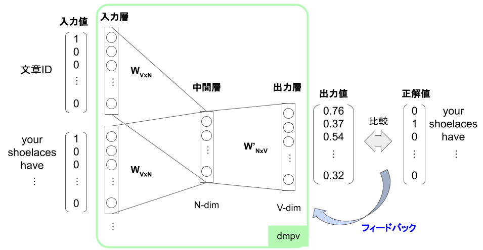
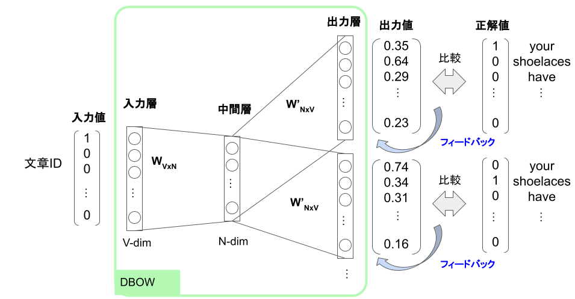

# Doc2Vecとは
Doc2VecはWord2Vecを応用したモデルで、単語だけでなく文書もベクトル化できる。Doc2Vecには、「dmpv」と「DBOW」の2種類あり、それぞれWord2Vecの「CBOW」と「skip-gram」に似たモデルである。

# dmpv
dmpvはWord2VecのCBOWに似たモデル。「文章IDと前後の単語からその中間の単語を予測する」というタスクを解く。

CBOWの入力層に文章IDを追加したモデル。

大量の文章を用いてモデル内の重みを更新することで、「文章IDと前後の単語からその中間の単語を予測する」という偽のタスクを解けるようにモデルを学習する。このモデルは文章と単語間の関係を学習しており、モデルの重みWVxNを文章ベクトル、単語ベクトルとして利用できる。

# DBOW
DBOWはWord2VecのSkip-gramと似たモデル。「文章IDからその文章を構成する単語を予測する」というタスクを解く。

入力値として文章IDをOne-hotベクトル化したものを、正解値としてその文章を構成する単語をOne-hotベクトル化したものを使用する。

大量の文章を用いてモデル内の重みを更新することで、「文章IDからその文章を構成する単語を予測する」という偽のタスクを解けるようにモデルを学習する。このモデルは文章と単語間の関係を学習しており、モデルの重みWVxNを文章ベクトルとして利用できる。