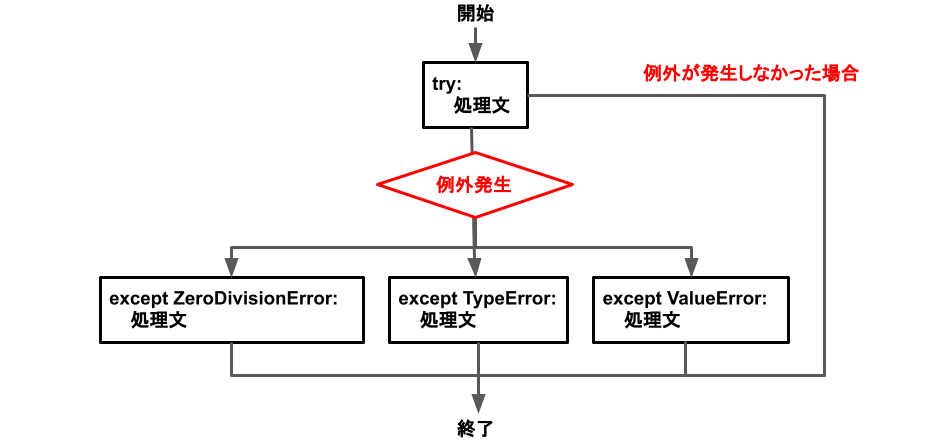

# 例外処理とは
例外処理は「戻り値とは異なる形でメソッドからエラーを返す仕組み」である。ロジックからエラー処理を分離するために使用する。

Pythonで「1/0」を実行すると組み込み例外「ZeroDivisionError」が発生し、例外が発生した箇所で処理が中断する。

```
num = 1/0
print('この部分は処理されないよ')

# ZeroDivisionError: division by zero
```

try-except文を用いると、例外が発生した箇所で処理を一時中断し、except節から処理を再開する。

```
try:
    num = 1/0
    print('この部分は処理されないよ')

except:
    print('なんかのErrorだよ')

# Output: なんかのErrorだよ
```

exceptの後に例外名を指定すると、例外の種類ごとに処理を振り分けることができる。

```
try:
    num = 1/0
    print('この部分は処理されないよ')

except ZeroDivisionError:
    print('ZeroDivisionErrorだよ')
except TypeError:
    print('TypeErrorだよ')
except ValueError:
    print('ValueErrorだよ')

# Output: ZeroDivisionErrorだよ
```

+ try-except文の処理フロー



# except節の探索
実行時に例外が発生すると、処理を中断してexcept節を探しに行く。except節が同メソッド内になければ呼び出し元のメソッドに、そこにもなければさらに上位の呼び出し元のメソッドに…、というように遡って探索する。最上位の呼び出し元まで探してexcept節がなければ、エラーを吐いて処理終了となる。

+ 例外発生箇所とexcept節が同メソッド内にある場合  
→ 同メソッド内のexcept節から処理を再開
```
def func1():
    func2()

def func2():
    try:
        print(1/0)
    except:
        print('Errorだよ')

# Output: Errorだよ
```

+ 例外発生箇所とexcept節が呼び出し元のメソッドにある場合  
→ 呼び出し元のメソッド内のexcept節から処理を再開
```
def func1():
    try:
        func2()
    except:
        print('Errorだよ')

def func2():
    print(1/0)

# Output: Errorだよ
```

+ 最上位の呼び出し元まで探してもexcept節がない場合  
→ exceptがないためエラーを吐いて終了
```
def func1():
    func2()

def func2():
    print(1/0)

# ZeroDivisionError: division by zero
```

# カスタム例外
前述のZeroDivisionError、TypeError、ValueErrorなどはPython標準の組み込み例外だが、標準の例外を継承することでユーザー独自のカスタム例外を作ることもできる。

```
class CustomExceptinon(Exception):
    pass

raise CustomExceptinon('カスタム例外だよ')

# CustomExceptinon: カスタム例外だよ
```

# 関数型プログラミングからみた例外処理
戻り値以外の方法でエラーを返す例外処理は副作用であるため、関数型プログラミングにおいては使用すべきでない。

関数型プログラミングでは、エラーが発生するような引数は型で禁止するべきである。