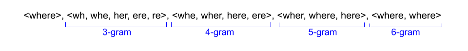

# fastTextとは
fastTextではWord2Vecで考慮されていないsubwordを導入する。

Word2Vecでは単語を1つのベクトルで表現していたが、fastTextでは単語をその単語とsubword（単語のn-gram）のベクトルの和で表現する。

例として、"where"という単語のsubwordを次に示す。なお、&lt;&gt;は単語の始端と終端を表す。

"where"という単語のベクトルは上記のsubwordのベクトルの和で表現する。

fastTextはsubwordを使用しているため、活用系など部分的に共通している単語同士を近いベクトルに変換できる、トレーニングデータ中に存在しない単語もベクトル化できるという特徴を持つ。