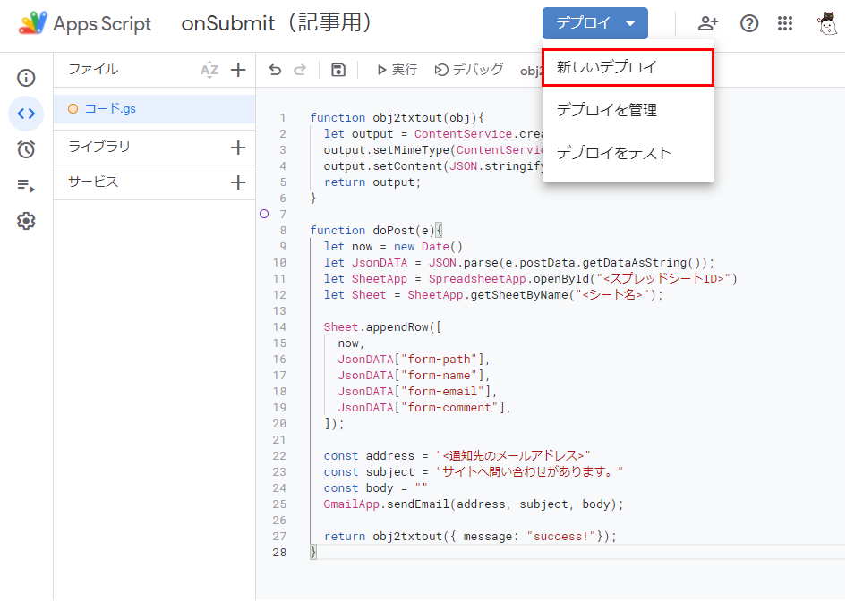

# 静的サイトとお問い合わせフォーム
静的サイトはデータベースをもたないため、お問い合わせフォームなどのデータベースを必要とする機能は外付けする必要がある。今回は、GatsbyJSサイトからGASを呼び出して、フォームに記入された内容をスプレッドシートに記録する。

以下の手順に従って、お問い合わせフォームを作成する。

1. 記録用のスプレッドシートを作成する  
<スプレッドシートID>と<シート名>を取得する。

2. GASスクリプトを作成する  
以下のコードを記載する。その際、<スプレッドシートID>、<シート名>、<通知先のメールアドレス>は各自書き換える。

GASスクリプト
```js
function obj2txtout(obj){
  let output = ContentService.createTextOutput();
  output.setMimeType(ContentService.MimeType.JSON);
  output.setContent(JSON.stringify(obj));
  return output;
}

function doPost(e){
  let now = new Date()
  let JsonDATA = JSON.parse(e.postData.getDataAsString());
  let SheetApp = SpreadsheetApp.openById("<スプレッドシートID>")
  let Sheet = SheetApp.getSheetByName("<シート名>");
  
  Sheet.appendRow([
    now,
    JsonDATA["form-path"],
    JsonDATA["form-name"],
    JsonDATA["form-email"],
    JsonDATA["form-comment"],
  ]);

  const address = "<通知先のメールアドレス>"
  const subject = "サイトへ問い合わせがあります。"
  const body = ""
  GmailApp.sendEmail(address, subject, body);

  return obj2txtout({ message: "success!"});
}
```

3. GASスクリプトを公開する




4. GatsbyJSからGASを呼び出す  
以下のコードを記載する。<ウェブアプリのURL>は各自書き換える。

src/pages/contact-form.js
```js
import * as React from "react"
import { useState } from 'react'

const Contact = ({ data, location }) => {
  const siteTitle = "お問い合わせ"

  const [sendAble, setSendAble] = useState(true)
  const [sendText, setSendText] = useState("送信する")

  const handleSubmit = (e) => {
    setSendAble(false)
    setSendText("送信中...")
    e.preventDefault();
    const URL = "<ウェブアプリのURL>";
    const pathDoc = document.getElementById("form-path");
    const nameDoc = document.getElementById("form-name");
    const emailDoc = document.getElementById("form-email");
    const commentDoc = document.getElementById("form-comment");

    let SendDATA = {
      "form-path" : pathDoc.value,
      "form-name" : nameDoc.value,
      "form-email" : emailDoc.value,
      "form-comment" : commentDoc.value,
    };
  
    fetch(URL, {
        "method":"POST",
        "mode":"no-cors",
        "body":JSON.stringify(SendDATA),
      })
      .then(data => {
        window.location.href = '/thanks';
      })
      .catch(error => {
        window.location.href = '/error';
      })
  }

  return (
    <>
      <meta charSet="UTF-8" />
      <h1 id="title">{siteTitle}</h1>
      <form id="form" onSubmit={(e) => handleSubmit(e)}>
        <input id="form-path" type="hidden" value={`https://web.middenii.com${location.pathname}`}></input>
            
        <div className="form-group" style={{marginBottom:"1rem"}}>
            <label htmlFor="form-name">お名前（ニックネーム）</label><br />
            <input id="form-name" className="form-control" type="text" placeholder="お名前" required></input>
        </div>

        <div className="form-group" style={{marginBottom:"1rem"}}>
            <label htmlFor="form-email">メールアドレス</label><br />
            <input id="form-email" className="form-control" type="email" placeholder="email@example.com" required></input>
        </div>
        
        <div className="form-group" style={{marginBottom:"1rem"}}>
            <label htmlFor="form-comment">コメント覧</label><br />
            <textarea id="form-comment" className="form-control" style={{height:"150px"}} placeholder="ご自由にご記入ください" required></textarea>
        </div>

        <div style={{textAlign:"center"}}>
            <button className="btn btn-outline-dark" type="submit" style={{width:"40%"}} disabled={!sendAble}>{sendText}</button>
        </div>
      </form>

    </>
  )
}

export default Contact
```