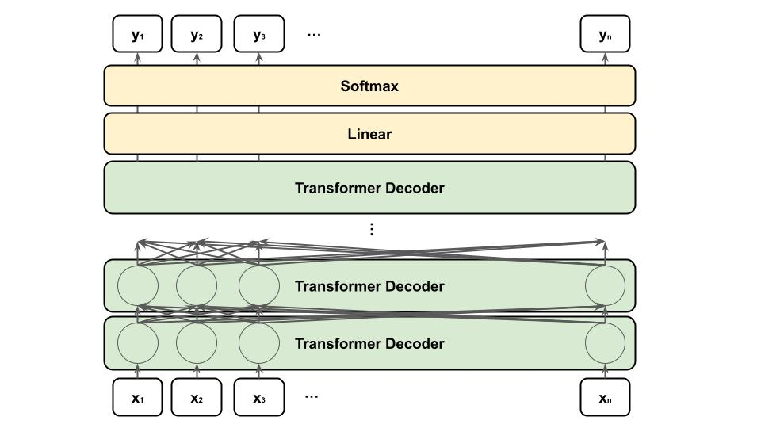

# GPTとは
TransformerのDecoder部分を複数重ねたモデル。



前の文章からターゲットの単語を予測するタスクを解く。Bertのように単語を[MASK]に置き換えるのではなく、Masked Self-Attentionによりターゲット以降の単語情報がマスキングされる。

Original
```
Thank you for inviting me to your party last week
```

Inputs
```
Thank you for inviting me to your party [MASK] [MASK]
```

Targets
```
last
```

GPTシリーズはTransformerのモデルサイズが大きくなるほど精度が向上することを示した(scaling law)。しかし、それに伴ってモデルが巨大になり、ファインチューニングにかかるコストが膨大になる。

そのため、GPT-2、GPT-3では、ファインチューニングは実施せず、それぞれ、zero-shotやfew-shotという学習方式を採用している。

zero-shot学習では、タスクを解くために追加でデータは必要としない。タスクの説明（task description）と回答を促す入力（prompt）の入力のみで欲しい出力が得られる。

例）zero-shot学習での入力
```
Translate English to French:
cheese =>
```

few-shot学習では、タスクを解くために追加で数例のデータのみ必要とする。タスクの説明（task description）と入出力の例（examples）と回答を促す入力（prompt）の入力のみで欲しい出力が得られる。

例）few-shot学習での入力
```
Translate English to French: 
sea otter => loutre de mer
peppermint => menthe poivrée
plush girafe => girafe peluche
cheese =>
```

zero-shotやfew-shot学習では、学習済みモデルのパラメーターがそのまま用いられるため、追加で学習が実施されることはない。

[^1] https://arxiv.org/abs/2005.14165

