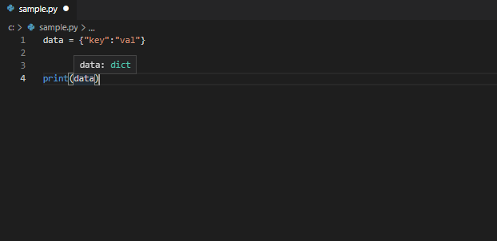

# 名前の重要性
コード設計において、名前の付け方は極めて重要であり、「適切な名前を付けることができたら設計の8割は完成している」と言われることもある。

逆に、コード設計がうまくできていないと、名前の競合を避けるあまり適切な名前を付けることができない。

# 良い名前の付け方
良い名前の条件は「明確で短い」こと。そして、読み手のメンタルモデルを壊さないような名前を付けるのが良い。

## 意図が明確な名前を付ける
書き手の意図が読み手に伝わるような名前を付けるのが良い。

例えば、get_html()よりdownload_html()の方がこの関数が何をするのかを明確に表現しているかもしれない。

```
# 悪い例
def get_html(url):
    ...

# 良い例
def download_html(url):
    ...
```

当然、偽情報を名前に埋め込んだり、違いがわからないような紛らわしい名前を付けるのは避けるのが良い。

```
name_list = "Bob"   # "Bob"はString型であり、List型ではない、偽情報

Account()
AccountInfo()    # AccountとAccountInfoの違いがわからない
```

## 1つの概念に1つの名前
1つの抽象概念には一貫して1つの名前を使うのが良い。

同じ処理をしているのに一方のクラスでは"to_csv"メソッド、もう一方のクラスでは"write_csv"メソッドと名前をつけるのは避けるのが良い。

```
class Memo():
    def to_csv(self): # csvに吐き出す処理
        ...

class Note():
    def write_csv(self): # csvに吐き出す処理
        ...
```

逆に、違う処理に同じメソッド名を付けるのも避けるのが良い。

```
class Memo():
    def add(self): # メモ帳に追記
        ...

class Note():
    def add(self): # ノートに新しいページを追加
        ...
```

## 必要十分な文脈を加える
必要に応じて文脈の情報を追加する。今までは名字だけで識別できていたのに、同じ名字の人が増えたため、フルネームで呼ばなければいけなくなったといった感じである。

```
# 悪い例
def function():
    name = "Aris"
    gest_name = "Bob"

# 良い例
def function():
    admin_name = "Aris"
    gest_name = "Bob"
```

余計な文脈は削除するのが良い。家族の中で呼び合うのに名字を呼ぶ必要はない。

```
# 悪い例
class Vehicle():
    def vehicle_run(self):
        ....

#良い例
class Vehicle():
    def run(self):
        ....
```

## エンコーディングは避ける
名前には本当に伝えたい情報だけを込めるのが良い。型やスコープ情報なども名前の中に埋め込むのは避けるのが良い。型情報などはIDEの型推定機能で確認できる。



## クラス名には名詞、メソッド名には動詞を付ける
クラス設計では、クラス名には名詞（主語）、メソッド名には動詞を付けるのが一般的である。特別な理由がない限り、読み手のメンタルモデルを壊さないほうが良い。

```
class Vehicle():
    
    def run(self):
        ...
```

## フォーマットに情報を込める
クラス名と変数名はどちらも名詞を用いることが多い。クラス名と変数名はフォーマットを区別して、見分けやすくするのが良い。

Pythonの命名規則はPEP-8と呼ばれるコーディング規約で定められている。

||命名規則|例|
|---|---|---|  
|関数名・変数名・メソッド名, モジュール名・パッケージ名|すべて小文字で表記。単語の区切りにアンダースコア(_)を使用。|my_function|
|クラス名・例外名|単語の頭文字のみ大文字で表記。|MyClass|
|定数名|すべて大文字で表記。単語の区切りにアンダースコア(_)を使います。|MY_CONSTANT|

## 解決領域の用語と問題領域の用語を使用する
システム変更の依頼者はいつも業務の専門知識を持ったユーザーであり、コードの読み手はいつもプログラマである。
読み手に理解しやすいコードにするために、問題領域の用語（業務の専門用語）と解決領域の用語（コンピュータサイエンスの用語、アルゴリズムの名前、パターンの名前、数学用語など）を用いるのが良い。

# 参考文献
- Clean Code　著：Robert C.Martin　訳：花井志生
- リーダブルコード　著：Dustin Boswell, Trevor Foucher　訳：角征典