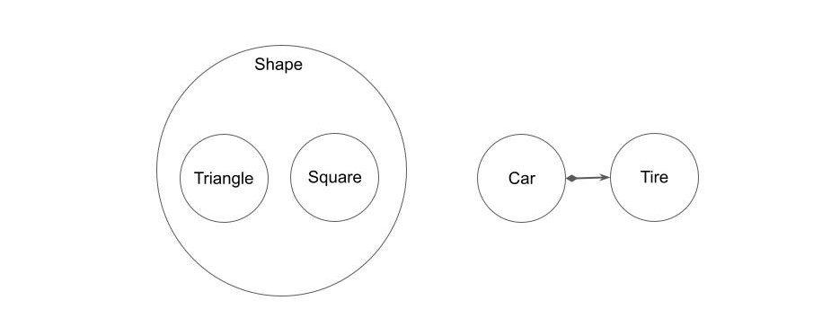

# 継承とは
子クラスが親クラスの機能を受け継いで、親と同じ機能を獲得すること。

オブジェクト指向における継承の本質は、置換可能な部品を量産するための型をインターフェイスとして規格化できる点である。

親クラスでインターフェイスを規定して、子クラスでそのインターフェースを継承することで置換可能な部品を量産できる。

# 集約と委譲とは
対象のクラスを呼び出し元のクラスでインスタンス化（集約）し、ツールとして利用する（委譲）こと。

# 継承より委譲
不用意に継承を使うと、子が親の機能全てを受け継いでしまうため、クラス間の結合度がどんどん高くなっていく。

子が親の部分集合になっていて、親を同じ役割を求められる（ポリモーフィズム）場合は継承を使用し、部分的に処理を委ねたいだけの場合は委譲を使用するのが良い。

