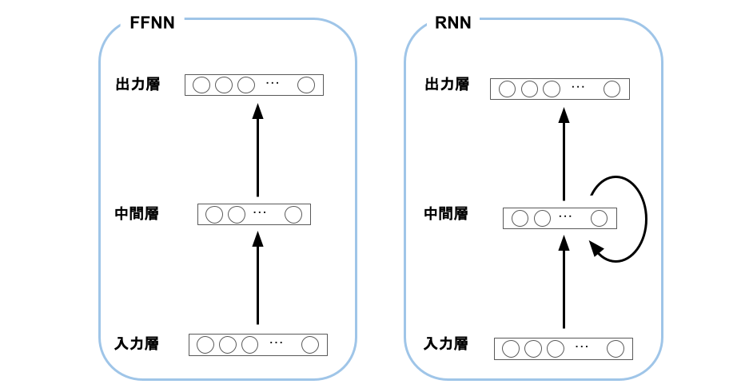
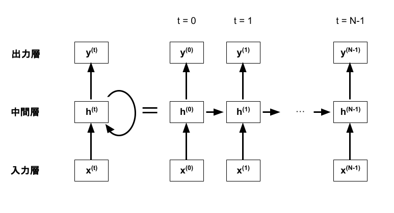
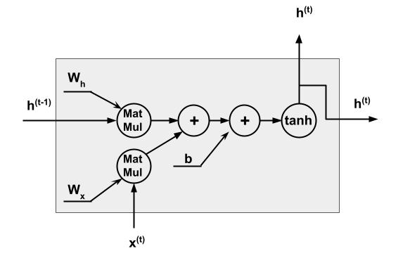
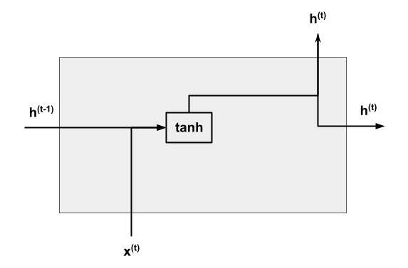
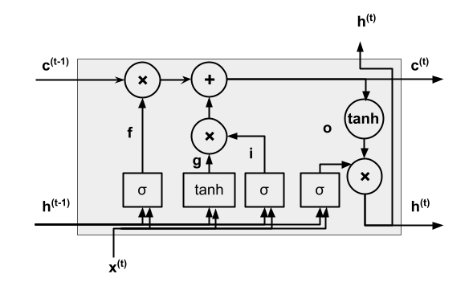

# RNNとは
FFNNに自己回帰型の構造を追加したニューラルネットワーク。自己回帰型の構造によって過去の情報を記憶できるため、しばしば時系列データ解析などに利用される。

各層に対応するベクトルをx, h, yとして書き直し、RNNの自己回帰型の構造を展開すると下記のように表記できる。

中間層での具体的な処理は図(a)のように表現でき、その図を簡略化して図(b)のように表現する。

(a) RNNの中間層での処理の図

(b) RNNの中間層での処理の簡略図

RNNの伝播式は以下で表せる。

# LSTMとは
単純なRNNでは勾配消失や勾配爆発によって、離れた時刻に発生した誤差をうまく伝達できないという問題がある。そのため、離れた時間の情報との依存関係を表現するパラメータの学習が困難になり、長期記憶が苦手である。

LSTMではRNNの中間層からの出力hとは別に長期記憶のメモリセルcを導入する。入力ゲート、忘却ゲート、出力ゲートの3つのゲートでメモリセルの値を調整する。入力ゲートと忘却ゲートで、短期と長期の情報のバランスを調整してメモリセルの値を更新し、その値を出力ゲートでさらに調整する。

入力ゲートは通常入力を更新後のメモリセルにどの程度加えるか，忘却ゲートは更新前のメモリセルを更新後のメモリセルどの程度残すか，出力ゲートは更新後のメモリセルを hidden state にどの程度出力するかを決定する．

中間層のユニットをメモリユニットで置き換えたLSTMでは、勾配消失や勾配爆発が起こりづらく、長い時系列データも扱える。

LSTMではRNNの中間層を下記のように変更する。

