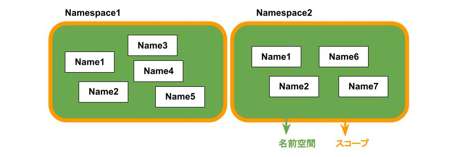

# そもそも名前とは
ある対象を別の対象から区別するための識別子。

同じ名前の個体は区別できない。ただし、後述する名前空間を分けることで区別することができる。

# 名前空間とは
名前の集合を構造化して分割管理することで、衝突をさけ参照しやすくするための概念。

名前に紐付けられた対象を特定するには、その名前がどの名前空間に属しているかを指定する必要がある。

同じ名前空間内では名前を重複して使うことはできないが、別の名前空間で使われた名前は使うことができる。

# スコープ
よく名前空間とセットででてくる概念にスコープというものがある。
スコープとは名前を直接参照できる範囲。所属する名前空間の有効範囲と同意。

+ 名前空間とスコープ

