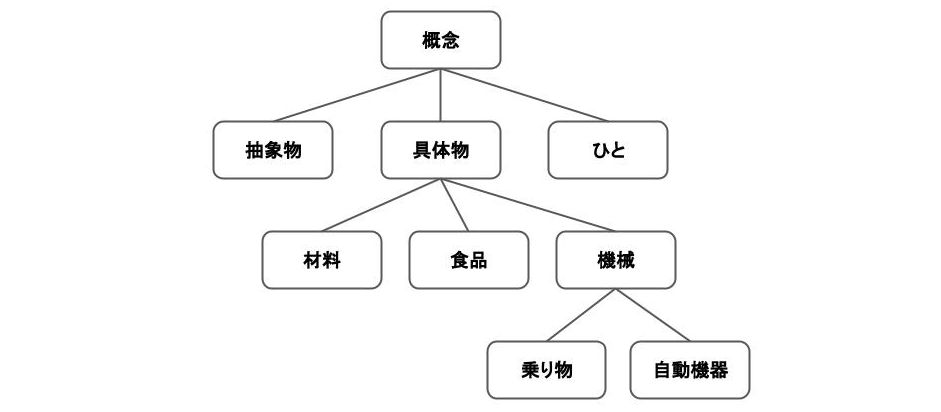

# 自然言語処理とは
自然言語をコンピュータが処理できる数値列に変換し、数値列のパターンから分類、検索、翻訳などを実施する処理。自然言語から数値列に変換する際に、微妙なニュアンスなどの大切な情報が失われる事が多い。

自然言語から数値列に置き換える方法は数多くあるが、大別するとシソーラスによる手法、カウントベースの手法、推論ベースの手法がある。

# シソーラスによる手法
シソーラスによる手法では、単語の意味的な階層構造を考慮して、人の手によって体系づけられた辞書（シソーラス）を利用する。有名なシソーラスに「WordNet」がある。

シソーラス内の単語の位置関係から類似度を算出し、分類や検索が可能。

# カウントベースの手法
カウントベースの手法では、単語の出現頻度をカウントして利用する。
例えば、文章を構成する単語の出現頻度を用いて文章を数値列に変換したり、周辺によく現れる単語の出現頻度を用いてターゲットの単語を数値列に変換したりする。

# 推論ベースの手法
推論ベースの手法では、ニューラルネットワークを利用して、前後の文脈からターゲットの単語を推論する過程で得られるモデルの重みを利用する。

