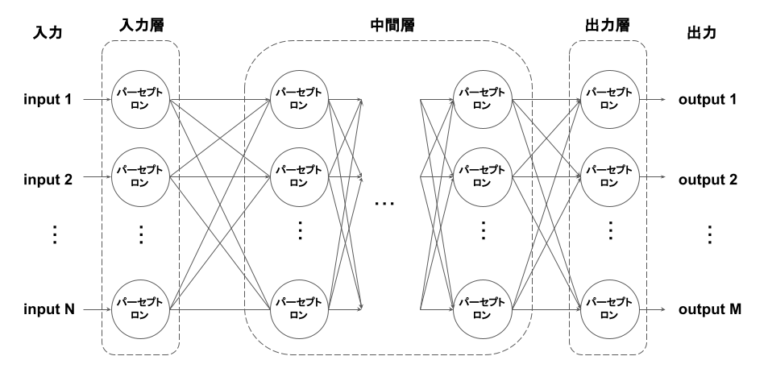
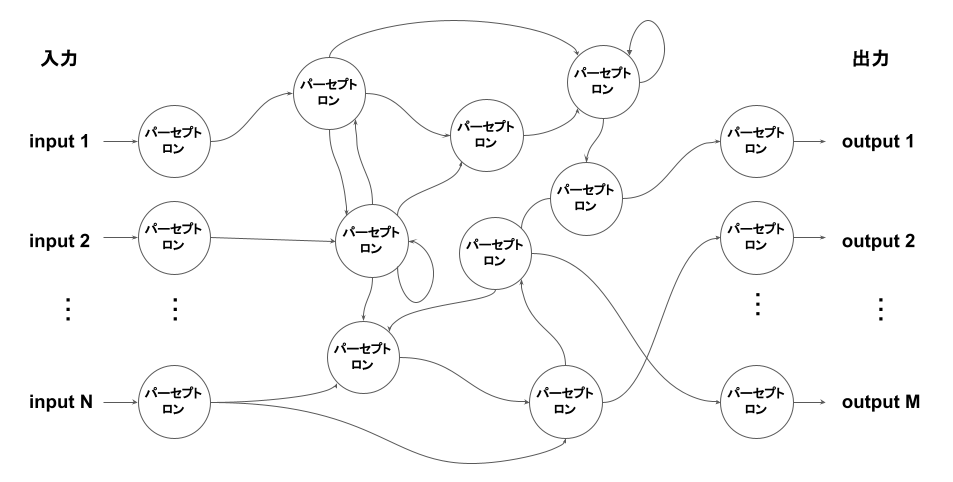

# ニューラルネットワークとは
パーセプトロンを組み合わせて構成される、脳の神経回路を模したモデル。フィードフォワードニューラルネットワーク(FFNN)とリカレントニューラルネットワーク(RNN)に大別できる。

+ フィードフォワードニューラルネットワーク(FFNN)
+ リカレントニューラルネットワーク(RNN)

活性化関数として、ステップ関数の代わりにシグモイド関数、ReLU関数、ソフトマックス関数などがよく用いれる。

# フィードフォワードニューラルネットワーク(FFNN)
一方向性の結合しか持たないニューラルネットワーク。ループがないため、過去の情報は記憶できない。

FFNNは多層パーセプトロンを一般化したもので、各層での計算は次のように表現できる。

$$
z = act(Wx + b)
$$

ただし、zは出力ベクトル、xは入力ベクトル、、Wは重み行列、bはバイアスベクトル、actは活性化関数である。

上記の関係式を改めて z = f(x) と置くと、FFNNは次のように表現できる。 

$$
f_n(f_{n-1}(...f_2(f_1(x))))
$$

このように、層の増加に伴ってモデルの表現力が向上するため、高精度の予測が可能になる。

# リカレントニューラルネットワーク(RNN)
自己回帰構造のような双方向性の結合を持つニューラルネットワーク。
自己回帰構造により過去の情報が記憶でき、時系列データの解析などに利用される。

# 補足
多層のニューラルネットワークを指してディープニューラルネットワークと呼ぶこともあるが、本記事では特に区別しない。