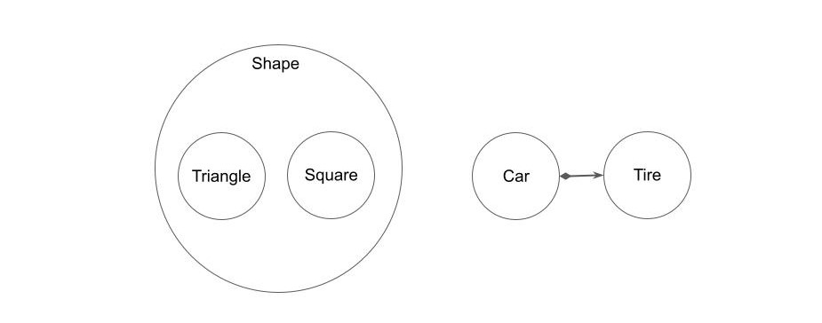

# オブジェクト指向プログラミング
コード設計の考え方の一つにオブジェクト指向プログラミングがある。オブジェクト指向プログラミングの代表的な概念には、「継承」、「ポリモーフィズム」、「カプセル化」などがある。

# 継承
子クラスが親クラスの機能を受け継いで、親クラスと同じ機能を獲得すること。

オブジェクト指向における継承の本質は、置換可能な部品を量産するための型をインターフェースとして規格化できる点である。親クラスでインターフェースを規定して、子クラスでそのインターフェースを継承することで置換可能な部品を量産できる。

# カプセル化
パルナスの規則に基づいて、インターフェースと実装を切り離し、実装を隠蔽してインターフェースのみを公開すること。適切にカプセル化することで、内部の情報や手続きを気にする必要がなくなるため、コードの利用や拡張が容易になる。

# ポリモーフィズム（多様体）
クラスのインターフェースを統一することで、インスタンスの切り替えが容易にできるようにする概念。

例として、抽象クラスとして動物クラスを作り、その下に具象クラスとして犬、猫、馬クラスを作る場合を考える。全てを共通のインターフェースに統一すれば、クライアントは呼び出す動物の切り替えが容易で、どの動物を呼び出しているか意識する必要がなくなる。

# 集約と委譲
対象のクラスを呼び出し元のクラスでインスタンス化（集約）し、ツールとして利用する（委譲）こと。

# 継承より委譲
不用意に継承を使うと、子が親の機能全てを受け継いでしまうため、クラス間の結合度がどんどん高くなっていく。

子が親の部分集合になっていて、親を同じ役割を求められる（ポリモーフィズム）場合は継承を使用し、部分的に処理を委ねたいだけの場合は委譲を使用するのが良い。

