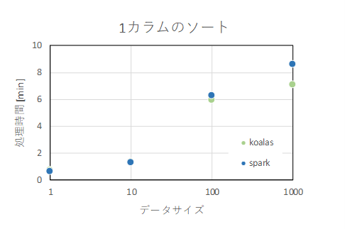
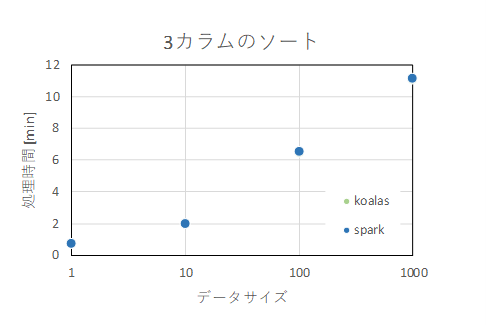
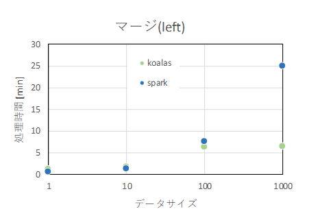
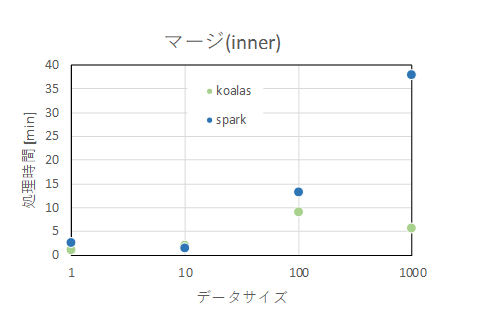
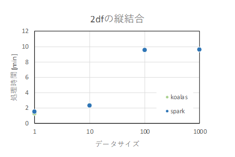
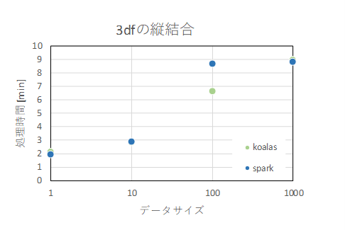
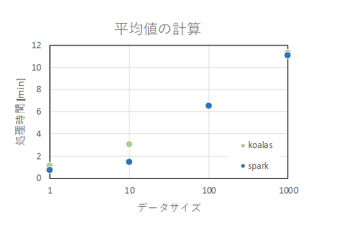

# 実施内容
Pandas / Koalas / PySparkについて、「df操作方法の比較」と「処理速度を比較」を実施した。  
※ KoalasはPandas-likeにPySpark dfを扱えるようにしたPySparkのラッパー的な存在


# 実施環境
動作確認にはAzure Synapse Studioの環境を使用。2020年12月現在Synapse Studio上で使用できる各パッケージのバージョンは以下のとおり。

```
pandasバージョン：0.25.3
koalasバージョン：1.2.0
sparkバージョン：2.4.4.2.6.99.201-25973884
```


# df操作方法の比較
## dfの作成と表示

<div style="overflow-x: scroll;">
| | Pandas | Koalas | PySpark |
| :---: | :---: | :---: | :---: |
| df作成 | pdf = pd.DataFrame(array) | kdf = ks.DataFrame(array) | sdf = spark.createDataFrame(array) |
| 表示① | pdf.head() | kdf.head() | sdf.show() |
| 表示② | pdf.tail() | － | － |
</div>

Koalasのtail()メソッドを使用しようとすると以下のメッセージがでる。

```
RuntimeError: tail can be used PySpark >= 3.0
```
PySpark 3.0以上なら使用できる模様。


## 列に関する操作

|  | Pandas | Koalas | PySpark |
| :---: | :---: | :---: | :---: |
| 型取得 | pdf.dtypes | kdf.dtypes | sdf.dtypes |
| 列名取得 | pdf.columns | kdf.columns | sdf.columns |
| 列数取得 | len(pdf.columns) | len(kdf.columns) | len(sdf.columns) |
| rename | pdf.rename(columns={'bef1':'aft1', 'bef2':'aft2'}) |  kdf.rename(columns={'bef1':'aft1', 'bef2':'aft2'}) |  sdf.select([func.col('bef1').alias('aft1'), func.col('bef2').alias('aft2')]) |
| 列選択 | pdf[['col11','col2']] | kdf[['col11','col2']] | sdf[['col11','col2']] |


## 行に関する操作  

|  | Pandas | Koalas | PySpark |
| :---: | :---: | :---: | :---: |
| 行数取得 | len(pdf) | len(kdf) | sdf.count() |
| index取得 | pdf.index | kdf.index | － |
| index選択① | pdf.loc[[1,2]] | kdf.loc[[1,2]] | － |
| index選択② | pdf.iloc[[1,2]] | pdf.iloc[[1,2]] | － |

PySparkではindexの操作はできない。KoalasはPandas同様の使用感。


## 集計操作
|  | Pandas | Koalas | PySpark |
| :---: | :---: | :---: | :---: |
| 統計情報を取得 | pdf.describe() |  kdf.describe() | － |
| 合計 | pdf.sum() | kdf.sum() | sdf.groupby().sum()
| 最小値 | pdf.min() | kdf.min() | sdf.groupby().min() |
| 最大値 | pdf.max() | kdf.max() | sdf.groupby().max() |
| 平均値 | pdf.mean() | kdf.mean() | sdf.groupby().mean() |
| 中央値 | pdf.median() | kdf.median() | － |
| 標準偏差 | pdf.std() | kdf.std() | － |
| 歪度 | pdf.skew() | kdf.skew() | － |
| 尖度 | pdf.kurt() | kdf.kurt() | － |
| グループごとのカウント | pdf.groupby('col1').count() | kdf.groupby('col1').count() | sdf.groupby('col1').count() |
| グループごとの合計 | pdf.groupby('col1').sum() | kdf.groupby('col1').sum() | sdf.groupby('col1').sum() |
| rolling | pdf.rolling(5).agg('sum') | － | － |

Koalas 1.2.0時点でrolling.aggは実装されていない。PySparkだと自分でudfを定義しなければならない集計関数も、Koalasだと簡単に計算できる。


## よく使われるdf操作 

|  | Pandas | Koalas | PySpark |
| :---: | :---: | :---: | :---: |
| apply | pdf[['col']].apply(lambda x: x+5) | kdf[['col']].apply(lambda x: x+5) | sdf.select(udf(lambda x: x+5)('col')) |
| ソート | pdf.sort_values(['col1','col2']) | df.sort_values(['col1','col2']) | sdf.sort(['col1','col2']) |
| マージ① | pdf_left.merge(pdf_right, on='key', how='left') | kdf_left.merge(kdf_right, on='key', how='left') | sdf_left.join(sdf_right, sdf_left['key'] == sdf_right['key'], "left") |
| マージ② | pd.merge(pdf_left, pdf_right, on='key', how='left') | ks.merge(kdf_left, kdf_right, on='key', how='left') | － |
| 縦結合① | pd.concat([pdf_up,pdf_down],ignore_index=True) | ks.concat([kdf_up,kdf_down], ignore_index=True) | reduce(DataFrame.unionByName, [sdf_up, sdf_down]) |
| 縦結合② | pdf_up.append(pdf_down, ignore_index=True) | kdf_up.append(kdf_down, ignore_index=True) | sdf_up.unionAll(sdf_down) |
| 抽出 | pdf[(pdf['col']>0.5) & (pdf['col']<0.6)] | kdf[(kdf['col']>0.5) & (kdf['col']<0.6)] | sdf.filter((func.col('col') > func.lit(0.5)) & (func.col('col') < func.lit(0.6))) |
| 列の追加① | pdf['newcol'] = 10 | kdf['newcol'] = 10 | sdf = sdf.withColumn('newcol',func.lit(10)) |
| 列の追加② |pdf['newcol'] = np.random.rand(len(pdf))| set_option("compute.ops_on_diff_frames", True) #設定の変更が必要<br>kdf['newcol'] = ks.Series(np.random.rand(len(kdf))) | sdf = sdf.withColumn('newcol',func.rand()) |
| 四則演算① |pdf['newcol'] = pdf['col1']+pdf['col2'] | kdf['newcol'] = kdf['col1']+kdf['col2'] | sdf = sdf.withColumn('newcol',func.col('col1')+func.col('col2')) |
| 四則演算② |pdf['newcol'] = pdf['col1']-pdf['col2'] | kdf['newcol'] = kdf['col1']-kdf['col2'] | sdf = sdf.withColumn('newcol',func.col('col1')-func.col('col2')) |
| 四則演算③ |pdf['newcol'] = pdf['col1']*pdf['col2'] | kdf['newcol'] = kdf['col1']*kdf['col2'] | sdf = sdf.withColumn('newcol',func.col('col1')*func.col('col2')) |
| 四則演算④ |pdf['newcol'] = pdf['col1']/pdf['col2'] | kdf['newcol'] = kdf['col1']/kdf['col2'] | sdf = sdf.withColumn('newcol',func.col('col1')/func.col('col2')) |
| timestamp型の演算 | pdf['dif_timestamp'] = pdf['end_timestamp'] - pdf['start_timestamp'] | kdf['dif_timestamp'] = kdf['end_timestamp'] - kdf['start_timestamp'] | － |

PySparkでのtimestamp列の計算は、unix timestamp型に変換して計算する必要があり面倒だが、KoalasだとPandas同様に簡単に計算できる。


## グラフ描画

|  | Pandas | Koalas | PySpark |
| :---: | :---: | :---: | :---: |
| 折れ線グラフ | pdf[['col1']].plot(kind='line') | kdf[['col1']].plot(kind='line') | － |
| 棒グラフ | pdf[['col1']].plot(kind='bar') | kdf[['col1']].plot(kind='bar') | － |
| 箱ひげ図 | pdf[['col1']].plot(kind='box') | － | － |
| ヒストグラム | pdf[['col1']].plot(kind='hist') | kdf[['col1']].plot(kind='hist') | － |
| カーネル密度推定 | pdf[['col1']].plot(kind='kde', bw_method=0.2) | kdf[['col1']].plot(kind='kde', bw_method=0.2) | － |
|  面グラフ | pdf[['col1']].plot(kind='area') | kdf[['col1']].plot(kind='area') | － |
| 散布図 | pdf.plot(x='col1', y='col2', kind='scatter') | kdf.plot(x='col1', y='col2', kind='scatter') | － |
| 六角形ビニング図 | pdf.plot(x='col1', y='col2', kind='hexbin') | － | － |
| 円グラフ | pdf[['col1']].plot(kind='pie', subplots=True) | kdf[['col1']].plot(kind='pie', subplots=True) | － |

Koalas 1.2.0時点でbox, hexbinは実装されていない。Koalasでは使えないplot機能もあるが、概ねPandasと同じ使用感。

## Series操作

|  | pandas | koalas | pyspark |
| :---: | :---: | :---: | :---: |
| Series作成 | pse = pd.Series([0,1,2,3]) |  kse = ks.Series([0,1,2,3]) | － |
| sort_index | pse.sort_index() |  kse.sort_index() | － |
| sort_values | pse.sort_values() |  kse.sort_values() | － |
| append | pse.append(pse2) |  kse.append(kse2) | － |
| concat | pd.concat([pse,pse2]) |  ks.concat([kse,kse2]) | － |
| 統計情報を取得 | pse.describe() |  kse.describe() | － |
| 合計を取得 | pse.sum() |  kse.sum() | － |

PySparkではSeriesが使用できない。KoalasはPandas同様の使用感。


## KoalasとSpark独自の処理

|  | Pandas | Koalas | PySpark |
| :---: | :---: | :---: | :---: |
| SQL文の使用 | － | ks.sql("SELECT * FROM {kdf} WHERE pig > 100") | spark.sql('SELECT * FROM sdf WHERE col1 > 0.5') |
| キャッシュの作成 | － | kdf.spark.cache() | sdf.cache() |


## dfの相互変換  
Pandas、Koalas、PySpark間のdfの相互変換

| Pandas | Koalas | PySpark |
| :---: | :---: | :---: |
| － | ks.from_pandas(pdf) | spark.createDataFrame(pdf) |
| － | ks.DataFrame(sdf) | sdf.to_koalas() |
| － | kdf.to_spark() | sdf.toPandas() |

Pandas、Koalas、PySpark間のdfの相互変換も簡単にできる。


# KoalasとPySpark処理速度比較
乱数で作成した76MBのデータを基準として行数を1, 10, 100, 1000倍したデータに対して、各処理のKoalasとPySparkの処理速度を計測した。

```python:
# 1カラムのソート
kdf.sort_values(['col1'])
sdf.sort(['col1'])
```


```python:
# 3カラムのソート
kdf.sort_values(['col1','col2','col3'])
sdf.sort(['col1','col2','col3'])
```


```python:
# マージ(left)
kdf_left.merge(kdf_right, on='key', how='left')
sdf_left.join(sdf_right, sdf_left['key'] == sdf_right['key'], 'left')
```


```python:
# マージ(inner)
kdf_left.merge(kdf_right, on='key', how='inner')
sdf_left.join(sdf_right, sdf_left['key'] == sdf_right['key'], 'inner')
```


```python:
# 2dfの縦結合
kdf.append(kdf, ignore_index=True)
sdf.unionAll(sdf)
```


```python:
# 3dfの縦結合
ks.concat([kdf,kdf,kdf], ignore_index=True)
reduce(DataFrame.unionByName, [sdf, sdf, sdf])
```


```python:
# 平均値の計算
kdf.groupby('col1').mean()
sdf.groupby('col1').mean()
```


KoalasとPySparkの処理速度は概ね同じ。マージ処理ではPySparkよりKoalasの方が処理速度が早くなっているが、うまく最適化してくれているのだろうか。（不明）

## 型変換  
- PandasからKoalas/PySparkにdfを変換したときの型の対応

| Pandas | Koalas | PySpark |
| :---: | :---: | :---: |
| object | object | int |
| int8 | int8 | bigint |
| int16 | int16 | bigint |
| int32 | int32 | bigint |
| int64 | int64 | bigint |
| uint8 | － | － |
| uint16 | － | － |
| uint32 | － | － |
| uint64 | － | － |
| float16 | － | － |
| float32 | float32 | double |
| float64 | float64 | double |
| float128 | － | － |
| complex64 | － | － |
| complex128 | － | － |
| complex256 | － | － |
| bool | bool | boolean |
| datetime64[ns] | datetime64[ns] | timestamp |

- SparkからPandas/Koalasにdfを変換したときの型の対応

| PySpark | Pandas | Koalas |
| :---: | :---: | :---: |
| date | － | － |
| tinyint | int8 | int8 |
| smallint | int16 | int16 |
| int | int32 | int32 |
| bigint | int64 | int64 |
| double | float64 | float64 |
| decimal(10,0) | object | object |


## Pandas / Koalas / PySparkそれぞれの特徴  

|  | Pandas | Koalas | PySpark |
| :---: | :---: | :---: | :---: |
| 分散処理 |  ×  |  ○  |  ○  |
| 処理速度 |  ◎  |  ○  |  ○  |
| dfの扱いやすさ |  ◎  |  ◎  |  ○  |
| Seriesの扱いやすさ |  ◎  |  ◎  |  －  |
| timestamp列の扱いやすさ |  ◎  |  ◎  |  △  |


# まとめ
Koalas 1.2.0ではまだ未実装の機能もあるが、概ねPandas-likeに使用できる。未実装な機能を呼び出そうとすると親切に「未実装だよ」とエラーメッセージを出してくれているので、将来的には実装してくれそう。
KoalasでSQL文もかけるため、今からPySparkを習得しようとしている人は、PySparkは使わずにKoalasだけでもいいかもしれない。
