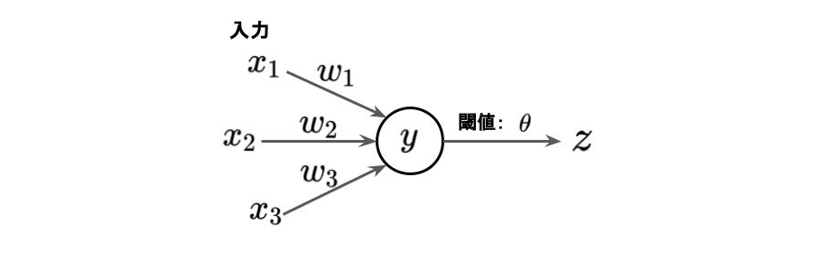

# パーセプトロンとは
脳の神経回路をモデル化したもの。人口ニューロンとも呼ばれる。

ニューロンは、刺激を受けて電気信号を発生し、その値が一定以上になるとシナプスを経由して他のニューロンに信号を伝達する（発火）。

# 単純パーセプトロンとは
ニューロンをモデル化したもので、入力xに重みwを乗じた値yを閾値θと比較して、小さければ出力zとして0を、大きければ出力zとして1を得る。

数式では以下のように表現できる。
  
$$
z = step(x_1 w_1 + x_2 w_2 + x_3 w_3 - θ)
$$

ただし、

$$
  step(x) =
  \left\{
    \begin{array}{cc}
      0 & (x < 0) \cr
      1 & (x >= 0)
    \end{array}
  \right.
$$

# 多層パーセプトロンとは
パーセプトロンを複数つなげて多層構造を作り、各層間のパーセプトロン互いに全て結合し、脳の神経回路を模したモデル。活性化関数としてステップ関数を用いた全結合型ニューラルネットワークと同義。

各層は単純パーセプトロンを縦に重ねた構造になっており、各層での計算は次のように表現できる。

$$
z = step(Wx - θ)
$$

ただし、zは各パーセプトロンからの出力ベクトル、xは各パーセプトロンへの入力ベクトル、Wは各パーセプトロンの重みを縦方向に積み重ねた重み行列、θは各パーセプトロンのしきい値を縦方向に積み重ねたしきい値ベクトルである。

また、ベクトルに対するstep関数の適用は、各成分にstep関数を適用した結果と等しいものとする。

上記の関係式を改めて z = f(x) と置くと、多層パーセプトロンは次のように表現できる。

$$
f_n(f_{n-1}(...f_2(f_1(x))))
$$