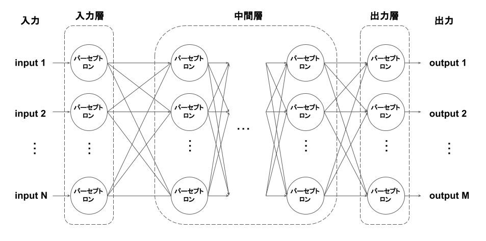

# パーセプトロンとは
脳の神経回路をモデル化したもの。人口ニューロンとも呼ばれる。

ニューロンは、刺激を受けて電気信号を発生し、その値が一定以上になるとシナプスを経由して他のニューロンに信号を伝達する（発火）。

# 単純パーセプトロンとは
ニューロンをモデル化したもので、入力 $x$ に重み $w$ を乗じた値 $y$ を閾値 $θ$ と比較して、小さければ出力0を、大きければ1を出力値 $z$ として得る。

数式では以下のように表現できる。
  
$$
z = step(x_1 w_1 + x_2 w_2 + x_3 w_3 - θ)
$$

ただし、

$$
  step(x) =
  \left\{
    \begin{array}{cc}
      0 & (x < 0) \cr
      1 & (x >= 0)
    \end{array}
  \right.
$$

# 多層パーセプトロンとは
パーセプトロンを複数つなげて多層構造を作り、各層間のパーセプトロン互いに全て結合し、脳の神経回路を模したモデル。全結合型フィードフォワードニューラルネットワークと同義。

各層は単純パーセプトロンを縦に並べた構造になっており、各層での計算は次のように表現できる。

$$
z = step(Wx - θ)
$$

ただし、 $z$ は各パーセプトロンからの出力ベクトル、 $x$ は各パーセプトロンへの入力ベクトル、 $W$ は各パーセプトロンの重みを縦方向に積み重ねた重み行列、 $θ$ は各パーセプトロンのしきい値を縦方向に積み重ねたしきい値ベクトルである。

また、ベクトルに対するstep関数の適用は、各成分にstep関数を適用した結果と等しいものとする。

上記の関係式を改めて $z = f(x)$ と置くと、多層パーセプトロンは次のように表現できる。

$$
f_n(f_{n-1}(...f_2(f_1(x))))
$$