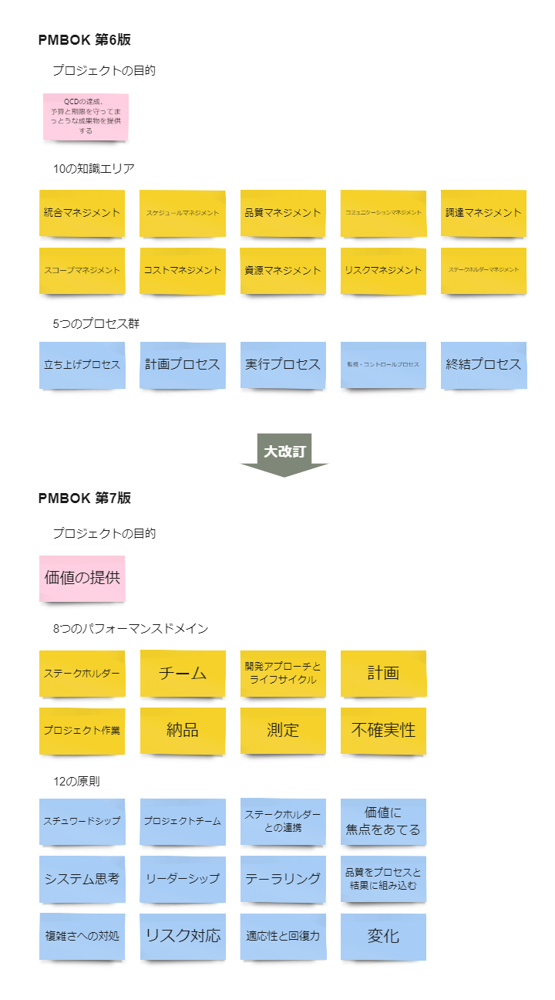
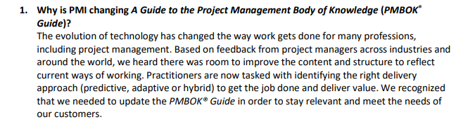
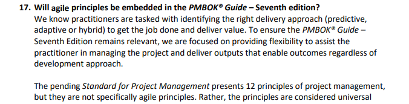
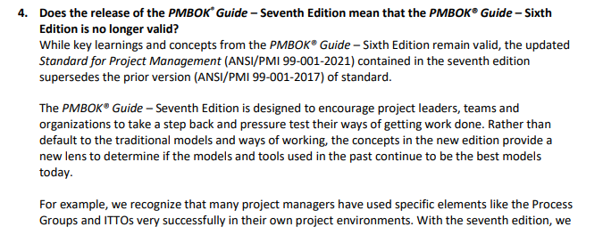

# 本記事の内容
2021年にPMBOK 第７版が発行されました。この第７版では第６版から内容が大きく変わっており、業界で話題となりました。
本記事ではPMBOK第６版と第７版で内容がどのように変わったのかについて解説します。

# PMBOKとは
PMBOKとは、米国のプロジェクトマネジメント協会（PMI）が提唱するプロジェクトマネジメントの知識体系です。ほぼ４年ごとに改定されていて、現在では世界標準として利用されています。

2021年にPMBOK 第７版が発行されましたが、第６版から内容が大きく変わっていたため、業界で話題となりました。

# PMBOKの変遷
1969年に米国のプロジェクトマネジメント協会が設立後、1987年に最初のPMBOKが発行されて以来、何度も改定が行われ、2022年現在はPMBOKガイド第7版まで発行されています。[1]

    1969年 プロジェクトマネジメント協会設立
    1987年 PMBOK 発刊
    1996年 PMBOKガイド初版 発刊
    2000年 PMBOKガイド第2版 発刊
    2004年 PMBOKガイド第3版 発刊
    2008年 PMBOKガイド第4版 発刊
    2012年 PMBOKガイド第5版 発刊
    2017年 PMBOKガイド第6版 発刊
    2021年 PMBOKガイド第7版 発刊
　　
# PMBOK 第７版のページ数
PMBOK 第７版（英語版）のページ数は250ページで、第６版の756ページと比較してかなり薄くなっています。

# PMBOK 第７版での改定内容
PMBOK 第６版と第７版の違いを見ていきます。大きく変わった部分は以下の3点です。[2]

+ 成果物中心から価値提供中心へ
+ 5つのプロセス群から12の原則へ
+ 10の知識エリアから8つのパフォーマンスドメインへ

## 成果物中心から価値提供中心へ
第６版では、QCD（Q: 品質、C: 費用、D: 納期）の達成に重点が置かれていて、成果物中心的な考え方です。

一方、第７版では、価値提供に焦点が当てられています。顧客にとって価値のあるソフトウェアを素早く提供することを重視するアジャイルの考え方が取り込まれたと言って良いでしょう。

## 5つのプロセス群から12の原則へ
PMBOK 第７版では、「5つのプロセス群」が廃止され、「12の原則」が導入されました。

12の原則

1. 勤勉で、礼儀正しく、思いやりのあるスチュワードになる
1. 協力的なプロジェクトチームや環境を作る
1. ステークホルダーと効果的、効率的に巻き込む
1. 価値に焦点をあてる
1. システムの相互作用を認識し、評価、対応する
1. リーダーシップを発揮する
1. 状況に応じて開発アプローチを調整する
1. プロセスと結果に品質を組み込む
1. 複雑さに対処する
1. リスク対応を最適化する
1. 適応性と回復力を強化する
1. あるべき未来を達成するために変更を可能にする

## 10の知識エリアから8つのパフォーマンスドメインへ
PMBOK 第７版では、「10の知識エリア」が廃止され、「8つのパフォーマンスドメイン」が導入されました。

8つのパフォーマンスドメイン

+ ステークホルダー：ステークホルダーに関連する領域
+ チーム：プロジェクトチームに関連する領域
+ 開発アプローチとライフサイクル：プロジェクトの開発アプローチやライフスタイルなどに関連する領域
+ 計画：プロジェクトを遂行する上で必要な要素の計画に関連する領域
+ プロジェクト作業：プロセスの確立、リソースの管理、教育環境などに関連する領域
+ 納品：顧客の要求を満たした成果物の提供に関連する領域
+ 測定：プロジェクトを遂行、維持に関連する領域
+ 不確実性：リスクやプロジェクトを取り巻く不確実性に関連する領域

# なぜ大幅に改定されたのか
公式のFAQs[3]に改訂理由についての記載があります。

ざっくり日本語訳すると「テクノロジーの発展に伴い、プロジェクトマネジメントを含め多くの職業で働き方が大きく変わりました。世界中の様々な業種のプロジェクトマネージャーからのフィードバックに基づいて、現在の働き方に応じてPMBOKの構成と内容に改善の余地があり、現在のニーズに合わせてPMBOKをアップデートする必要があると判断しました。」とのことです。

それにしても変わりすぎです。第７版ではアジャイルの考え方が大きく取り込まれたとのうわさですが、公式のFAQs[3]にアジャイルについての記載もありましたので見てみましょう。

ざっくり日本語訳すると「PMBOK 第７版は開発アプローチ（ウォーターフォールやアジャイル）に関わらず価値を提供することに焦点を当てています。PMBOK 第７版には12の原則があるけど、アジャイルの原則とは別物です。むしろ、開発アプローチに関わらず普遍的なものです。」とのことです。

歴史の長いPMBOKに、現在主流のアジャイルの考え方を包括した形で取り込むには、構成からガラリと変える必要があったと推測されます。

# 第６版の学習は無駄になる？
こちらも公式のFAQs[4]に記載がありましたので見てみましょう。

ざっくり日本語訳すると「PMBOK 第６版は引き続き有効ですが、プロジェクトマネジメント基準は更新されました。何も考えずに第６版のプロセス群を適用するのではなく、第７版の12の原則に基づいてもっと良い別のアプローチがないか考えましょう。」とのことです。

PMBOK 第6版はプロジェクトマネジメントの原則を達成するためのプラクティスとして部分的に有効ではあるが、ただ適用すれば良いというものではないということを示唆されていますね。第７版では、変化の激しい現代社会の中で、どのようにプロジェクトと向き合えばよいのか一歩引いた視点から教えてくれているようです。

なお、PMBOK 第６版のプラクティスは「[PMI Standards＋](https://standardsplus.pmi.org/?redirect=/home)」からデジタルコンテンツとして利用できます。

# まとめ
2021年に発行されたPMBOK 第７版では、第６版から大幅にアップデートされました。プロジェクトの目的が成果物中心から価値提供中心へと変更され、アジャイルの考え方が取り込まれました。

# 参照
1. [PMBOKガイドの変遷](https://www.jstage.jst.go.jp/article/jseeja/2012/0/2012_194/_pdf)
1. [プロジェクトマネジメント知識体系ガイド（PMBOKガイド）第7版＋プロジェクトマネジメント標準](https://www.pmi-japan.shop/shopdetail/000000000028/)
1. [PMBOKガイド公式FAQs(2020/10/30)](https://www.pmi.org/-/media/pmi/documents/public/pdf/pmbok-standards/pmbok-guide-public-faqs-30-oct-2020.pdf)
1. [PMBOKガイド公式FAQs(2021/7/1)](https://www.pmi.org/-/media/pmi/documents/public/pdf/pmbok-standards/pmbok-guide-public-faqs-1-july-2021.pdf?v=18e3382e-0c61-4b86-b0e8-daaf5ea2b13d)