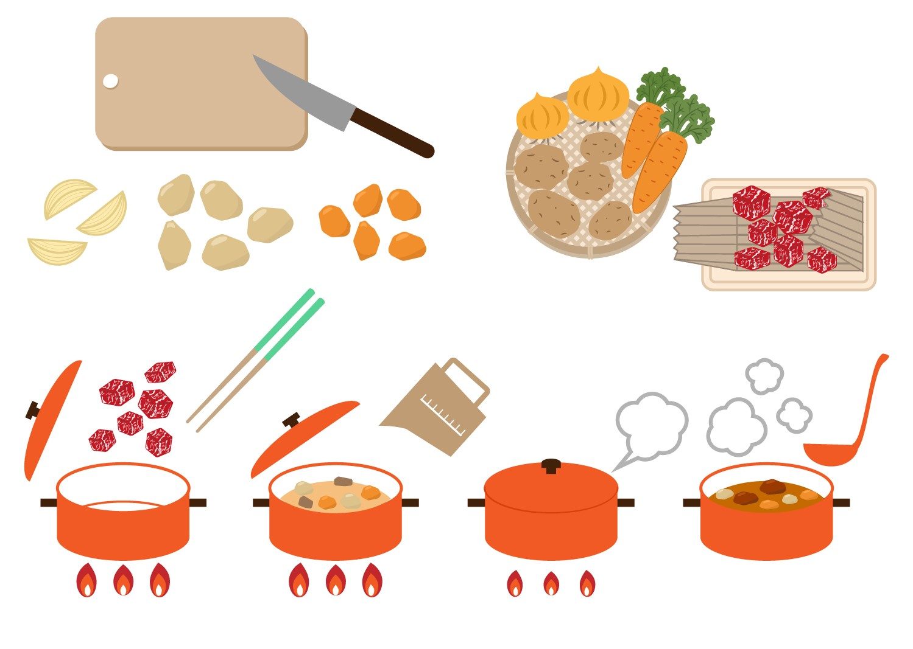

# 手続き型プログラミングとは
複数の「命令」をまとめて、より抽象的な「手続き」という単位でコードに記述する手法。

料理に例えると、調理人の実施する「手続き」を、レシピとして記述するイメージ。調理人の細かな動きは「手続き」の中に隠蔽され、全体の見通しがよくなる。ここで、調理人がコンピュータ、レシピがコードである。

```
# レシピ
1. ニンジン100gを2cmの角切りにする
2. ジャガイモ200gを2cmの角切りにする
3. 玉ねぎ400gをくし形切りにする
4. 鍋にサラダ油大さじ1を加える
5. 牛肉、玉ねぎ、じゃがいも、にんじんを加え、炒める
6. 水を加え、中火で15分煮込む
7. 市販のルーを加え、弱火で10分煮込む
```



