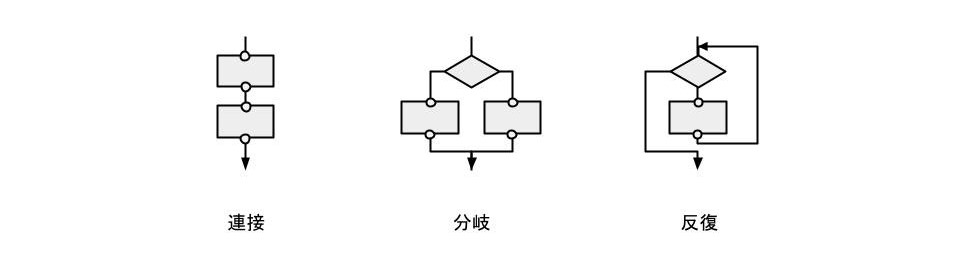
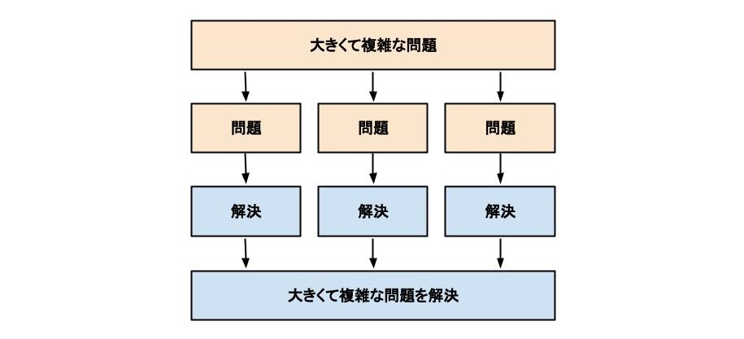

# プログラミングパラダイムとは
プログラミングする際のコード設計の考え方。プログラミングパラダイムは、コードの表現力を保ちつつ、制約によって記述の自由度（複雑性）を減らして、コードの可読性の高めることを目的として発展してきた。


# 主なプログラミングパラダイム
+ 命令型プログラミング
    + 手続き型
    + 構造化プログラミング
    + オブジェクト指向プログラミング

+ 宣言型プログラミング
    + 関数型プログラミング


# 命令型プログラミング
コンピュータが実行する処理（命令）を一行ずつ実行順にコードに記述する手法。

しばしば、「宣言型プログラミング」の対比として用いられる。この場合、「手続き型プログラニング」とほぼ同義。

料理に例えると、調理人の細かいすべて動きを命令として記述するイメージ。ここで、調理人がコンピュータ、命令がコードである。

```
# 命令
1. 包丁を握る
2. ニンジンをまな板の上に置く
3. 包丁をニンジンの先端に合わせる
4. 包丁を上に動かす
5. ニンジンを2cm包丁側に動かす
6. 包丁を下に動かしてニンジンを切断する
     ...
```

処理順通りに記載されているためコードが追いやすい一方で、全体がひとまとまりとなっているため、変更の影響がコード全体に及ぶ、部分的な再利用が困難になるなどの欠点がある。

コンピュータハードウェアは命令型の機械語を実行するように設計されているため、どんなプログラムも最終的には命令型に変換される。

命令型の記述はコンピュータの構造に依存するため、可用性の観点からプログラムを命令型で記述するのはできるだけ先延ばし（低レイヤで処理するように）したい。


# 手続き型プログラミング
複数の「命令」をまとめて、より抽象的な「手続き」という単位でコードに記述する手法。

料理に例えると、調理人の実施する「手続き」を、レシピとして記述するイメージ。調理人の細かな動きは「手続き」の中に隠蔽され、全体の見通しがよくなる。ここで、調理人がコンピュータ、レシピがコードである。

```
# レシピ
1. ニンジン100gを2cmの角切りにする
2. ジャガイモ200gを2cmの角切りにする
3. 玉ねぎ400gをくし形切りにする
4. 鍋にサラダ油大さじ1を加える
5. 牛肉、玉ねぎ、じゃがいも、にんじんを加え、炒める
6. 水を加え、中火で15分煮込む
7. 市販のルーを加え、弱火で10分煮込む
```


# 構造化プログラミング
制御構造を連接、分岐、反復の3つだけに制限し、その組み合わせによってコードを記述する手法。コードは「手続き」という単位で記述され、分割統治法に基づいて階層構造に整理される。「手続き」という単位で記述する点に関しては「手続き型プログラミング」と同じ。

以下の「構造化定理」と「分割統治法」を基盤としている。

+ 構造化定理  
全てのアルゴリズムは、連接、分岐、反復の3つの基本制御構造の組み合わせで記述できることを示す定理。
コラド・ベームとジュゼッペ・ヤコピーニによって数学的に証明された。ベーム-ヤコピーニの定理とも呼ばれる。



+ 分割統治法  
大きくて複雑な問題を、簡単に解けるサイズにまで分割し、分割された問題を個別に解くことによって効率的に解決策を得ようとする手法。




# オブジェクト指向プログラミング
データと処理をまとめて1つのオブジェクトとして、オブジェクトの単位でコードを記述する。

料理に例えると、カレー調理チームを作って、カレーを作ってもらうイメージ。各役割がそれぞれのオブジェクトで、チームの設計図がコードである。

```
# カレー調理チームの設計図
・全体を指揮する役割 1人
・野菜を切る役割 3人
・野菜を炒める役割 1人
・野菜を煮る役割 1人
```

調理の際、全体を指揮する役割の人は、調理段階に応じて必要な役割の人を呼び出すだけでよく、野菜の切り方の詳細を知っている必要はない。そのため、食材が増えた際も、食材を切る人を追加で呼び出すだけでよく拡張性が高い。

また、完全に役割分担されているため、カレーを作る際に呼び出した玉ねぎ切る人をサラダを作る際にも呼び出すことができて再利用性が高い。同時に、調理がうまくいかないときにどこで問題が発生しているのかのテストもしやすく保守性も高い。


# 宣言型プログラミング
得ようとする出力の性質の宣言のみをコードに記述する手法。細かい処理は後のレイヤーに委譲される。非命令型プログラニングと同義で扱われることが多い。

料理で例えると、調理人にカレー 1人前と注文するイメージ。このとき、調理人がコンピュータで、注文がコードである。処理の詳細（ニンジンを角切りにするか乱切りにするかなど）は調理人に委譲される。

```
# 注文
カレー 1人前
```


# 関数型プログラミング
データと処理をそれぞれ、型と関数として厳密に区別してコードを記述する。宣言型プログラミングの一種。

料理に例えると、カレー調理器に食材を投入すると調理済みのカレーが出てくるイメージ。カレー調理器がコンピュータで、調理器の説明書がコードである。

```
# 操作方法
1. 使用する野菜を投入する
2. 「調理を開始」ボタンをクリック
3. カレーが出来上がるまで待機する
```

関数型プログラミングではデータと処理を厳密に区別しており、オブジェクト指向プログラミングと異なり状態を保持しないため、疎結合でテストしやすい。


# 参考資料
+ オブジェクト指向のこころ, アラン・シャロット＋ジェームズ・R・トロット
+ オブジェクト指向でなぜつくるのか, 平澤章
+ Java言語で学ぶデザインパターン入門, 結城浩
+ 関数型プログラミングの基礎, 立川察理