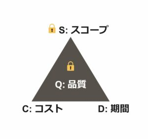

# 本記事の内容
ウォーターフォル開発からアジャイル開発へのシフトが起こっていますが、このような大きな変化の流れの中にも、変わらないプロジェクトの基本構造があります。

本記事ではプロジェクトの基本構造について整理し、さまざまなプロジェクトに応用できる共通の考え方を取り上げます。

# プロジェクトとは
プロジェクトとは、「独自のプロダクトやサービスなどを創造するための有期性のある業務である」と定義されています。

プロジェクトには、期間やコストなどの制約条件がつきもので、そのような制約条件を満たすように顧客価値を最大化することを目指しています。

## プロジェクトのトレードオフ
プロジェクトでは様々なトレードオフが発生します。例えば、計算リソースにGPUを追加すると期間が短縮できるが費用がかさむ、品質を上げるためにテスト要員を追加するなどが考えられます。

このようなトレードオフを考える上でよく使われるフレームワークの一つにQCDSがあります。

+ Q (Quality) ：品質
+ C (Cost) ：コスト
+ D (Delivery)：期間
+ S (Scope) ：スコープ

顧客価値を大きく損なうことになるため、「品質」を犠牲にすることはあってはなりません。そこで、（品質以外の）「コスト」、「期間」、「スコープ」を頂点として三角形を作り、制約条件のトレードオフを可視化します。この三角形は鉄のトライアングル[1]と呼ばれていて、各頂点が相互に影響を与えていることを示しています。

## スコープ、コスト、期間の関係
「スコープ」と「期間」、「スコープ」と「コスト」には正の相関、「期間」と「コスト」には負の相関があります。以下はそのイメージ図で、この関係はプロジェクトによって異なります。

例えば、「スコープ」が大きくなると、「期間」か「コスト」を大きくして調整する必要があります。「期間」が短くなると、「スコープ」を小さくするあるいは「コスト」を大きくして調整する必要があります。

また、「スコープ」、「期間」、「コスト」が変わっても、一定以上の「品質」が担保されている必要があります。

「スコープ」、「期間」、「コスト」すべてを固定してしまった場合、「品質」を犠牲になってプロジェクトの失敗につながる可能性があります。

# ウォーターフォール開発
ウォーターフォールモデル開発では「スコープ」を固定して、「期間」、「コスト」の見積もりを実施します。そのため、「期間」、「コスト」は最初は可変ですが、一旦見積もりが完了すると固定されたものとして扱われます。

プロジェクトが進むに連れて、プロジェクト開始時点での見積もりがはずれるリスクは大きくなります。以下はそのイメージ図で、簡単のため線形モデルを採用しています。

見積もりがはずれた場合、プロジェクトは失敗したと判断されます。

# アジャイル開発
アジャイル開発では「期間」、「コスト」を固定して「スコープ」の見積もりを実施します。「スコープ」は最初は可変ですが、一旦見積もりが完了すると固定されたものとして扱われます。

ただし、アジャイル開発では一定の短い期間で開発サイクルを繰り返す（イテレーション）手法を採用しています。イテレーションが進むたびに小さく「スコープ」の見積もりが実施されるため、固定される「スコープ」の範囲は小さくなります。

各イテレーション内では、（ウォータフォールの場合と同様に）プロジェクトが進むに連れて、プロジェクト開始時点での見積もりがはずれるリスクは大きくなります。

しかし、イテレーションが進むたびに小さく「スコープ」の見積もりが実施されるため、見積もりがはずれるリスクを小さく抑えることができます。以下はそのイメージ図です。

ウォーターフォールの場合と比較すると、アジャイル開発の方がプロジェクトが失敗するリスクが小さくなっていることがわかります。

# まとめ
QCDSと鉄のトライアングルと用いて、さまざまなプロジェクトに共通するプロジェクトの本質と基本構造について整理しました。また、理解を深めるための具体例として、ウォーターフォール開発とアジャイル開発について取り上げました。

# 参考資料
1. [鉄のトライアングル](https://support.microsoft.com/en-us?correlationid=f114668f-c2fa-44c3-a1a8-c6be384b21eb&ui=en-us&rs=en-us&ad=us)
