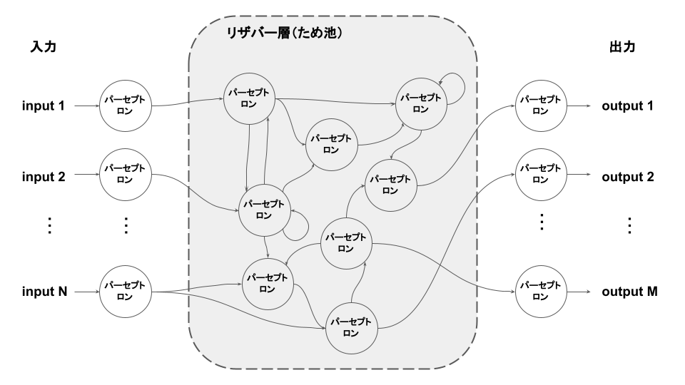

# リザーバコンピューティング(RC)とは
RNNの中間層をため池(高次元の非線形物理系)に置き換えたニューラルネットワーク。リヤプノフ指数が負の力学系はRCに利用できる。

出力層以外の重みは固定しているため、RNNより少ない学習コストと学習データでの学習が可能。

歴史的にはLiquid State Machine(脳科学)とEcho State Network(情報科学)が統一されたもの。

