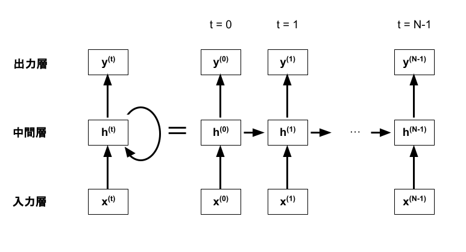
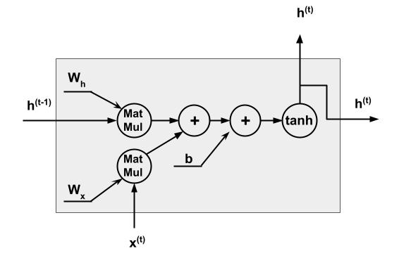
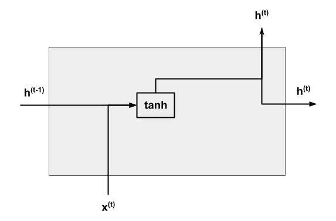

# リカレントニューラルネットワーク(RNN)とは
RNNはFFNNに自己回帰型の構造を追加したニューラルネットワークである。この自己回帰型の構造によって過去の情報を保持でき、時系列データを扱うことができるようになる。

各層に対応するベクトルをx, h, yとして書き直し、RNNの自己回帰型の構造を展開すると下記のように表記できる。

中間層での具体的な処理は図(a)のように表現でき、その図を簡略化して図(b)のように表現する。

(a) RNNの中間層での処理の図

(b) RNNの中間層での処理の簡略図

RNNの伝播式は以下で表せる。
