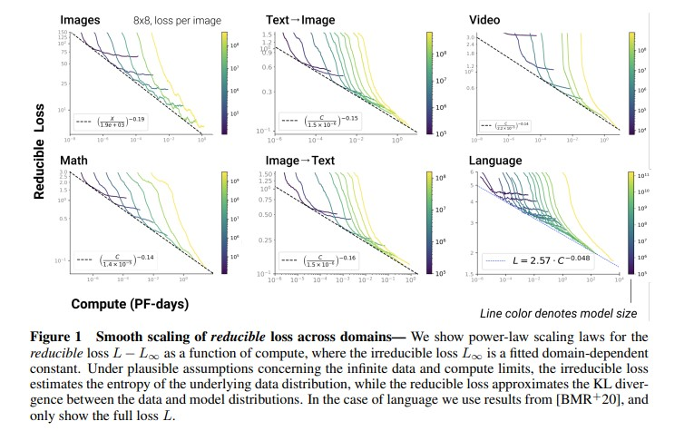

# Scaling Lawとは
Transformerの性能は誤差Lはパラメータ数N、データセットサイズD、計算予算Cのそれぞれを変数とする冪乗則に従う。ただし、他の2変数がボトルネックにならないものとする。

出典："Scaling Laws for Autoregressive Generative Modeling"[^1]

数式で表すと以下のようになる。

L∝N^(-α_N)  
L∝D^(-α_D)  
L∝C^(-α_C)  

<!-- C = 6NBS -->

[^1] https://arxiv.org/abs/2010.14701