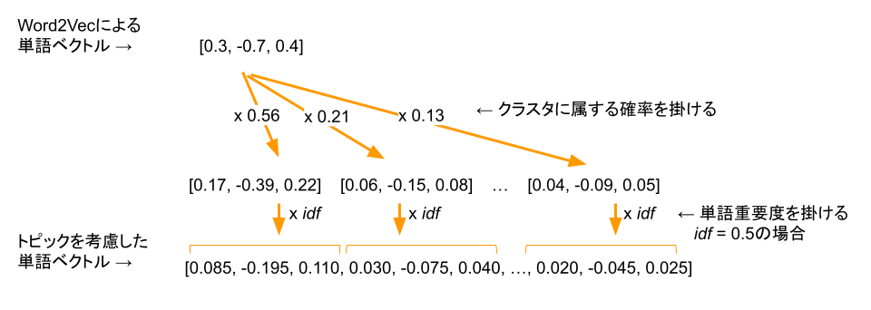
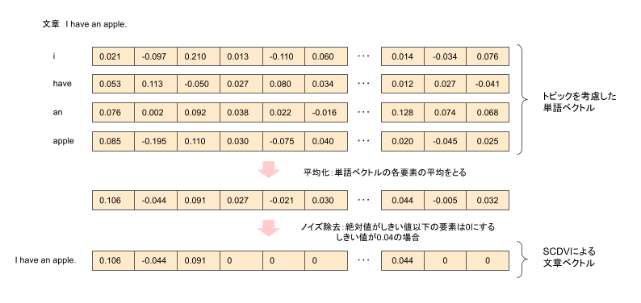

# SCDVとは
SCDVではWord2Vec（あるいはfastText）で作った単語ベクトルをうまく足し合わせることで文章ベクトルを作成する。

Word2Vecで作った単語ベクトルを足し合わせる際、単純に足し合わるだけでは、文脈に応じた単語のニュアンスの違いを考慮できない。例えば、果物の"apple"も、企業の"apple"も同じ単語ベクトルとして足し合わせてしまうことになる。そこで、単純に足し合わるのではなく、GMMのソフトクラスタリングにより単語をクラスタリングし、クラスタごとに単語を足し合わせる。

# SCDVによる文章ベクトル化手順
SCDVでは、以下の手順で文章のベクトル表現を得る。

1. GMMのソフトクラスタリングにより各単語をクラスタリングする。
    |単語|分散表現|クラスタ1|クラスタ2|...|クラスタN|  
    |---|---|---|---|---|---|  
    |apple|[0.3, -0.7, 0.4]|0.56|0.21|...|0.13|
    
2. 各クラスタを潜在トピックとみなし、単語ベクトルを「トピックを考慮した単語ベクトル」に書き換える。「トピックを考慮した単語ベクトル」の次元は「Word2Vecによる単語ベクトルの次元」×「クラスタ数」になる。

3. 文章を構成する「トピックを考慮した単語ベクトル」の平均をとり、絶対値がしきい値以下の要素を0として文章ベクトルを作成する。

