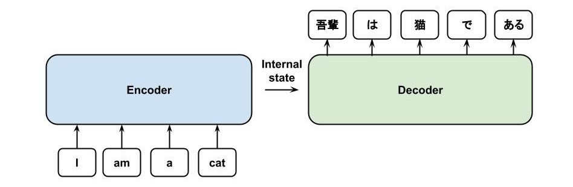
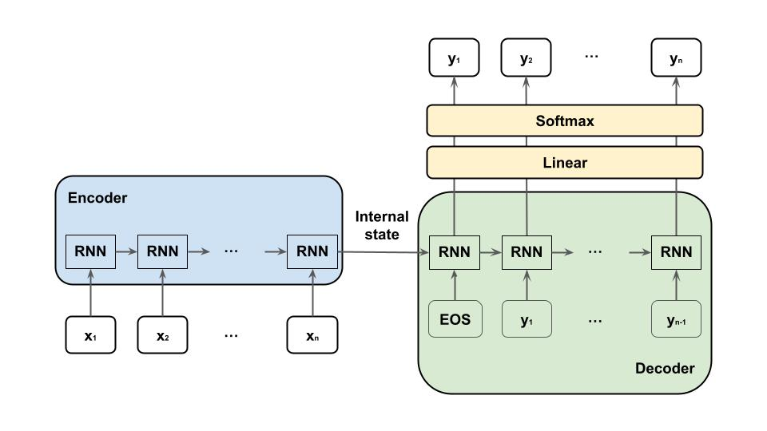

# seq2seqとは
seq2seqはEncoder-Decoderモデルとも呼ばる。Encoder側では、入力シーケンスを固定長のベクトルに符号化(encode)し、符号化された固定長のベクトルは内部状態としてDecoder側に渡される。Decoder側では、受け取った内部状態を出力シーケンスへと復号化(decode)する。

# シンプルなseq2seq
seq2seqのEncoderとDecoderはそれぞれRNN(あるいはLSTM)で構成される。同時に2つのRNNを学習し、入力のベクトル列に対して出力のベクトル列を得る条件付き確率を最大化する。

Encoder側では出力結果は使用されずに破棄され、最後の隠れ状態のみをDecoder側に渡される。Decoder側では一つ前の隠れ状態および出力を次のRNNへの入力して逐次的に学習する。

# Attentionを用いたseq2seq
シンプルなseq2seqではEncoderの最後の隠れ状態のみしか利用していなかった。長い文章では、最後の隠れ状態の情報だけでは初めの方の情報をうまく学習できない。

Encoderのすべての隠れ状態をAttentionに入力することで、長い文章でもうまく学習できるようになる。

