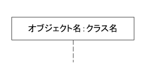
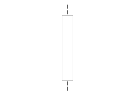
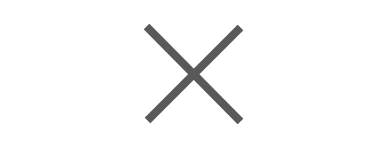
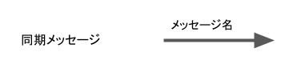
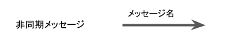
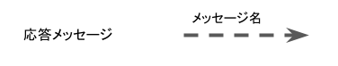

# シーケンス図とは
UML（Unified Modeling Language: 統一モデリング言語）の代表的な図の一つ。
「ライフライン」、「実行仕様」、「停止」、「メッセージ」と呼ばれる記号を用いてクラス間のやりとりを時間軸に沿って表現する。

+ ライフライン

    「オブジェクト名：クラス名」を記載して、オブジェクトやクラスを表現する。

    

+ 実行仕様

    ライフラインの点線上に四角形を配置して、そのライフラインが実行状態であることを表現する。

    

+ 停止

    ライフラインの消滅を表現する。

    

+ メッセージ

    オブジェクト間のメッセージを矢印で表現する。メッセージには同期メッセージ、非同期メッセージ、応答メッセージがある。

    + 同期メッセージ

        実行元のライフラインはこのメッセージの処理が終了するまで待機する。

        

    + 非同期メッセージ

        実行元のライフラインはこのメッセージの処理の完了を待たずに次のメッセージを起動する。

        

    + 応答メッセージ

        実行した処理の戻り値。

        
