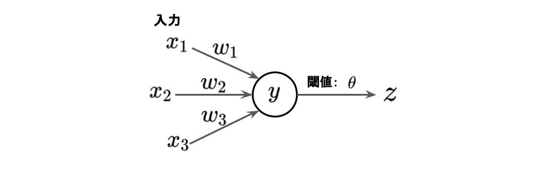

# 単純パーセプトロンとは
脳の神経回路をモデル化したもの。人口ニューロンとも呼ばれる。

ニューロンは、刺激を受けて電気信号を発生し、その値が一定以上になるとシナプスを経由して他のニューロンに信号を伝達する（発火）。

単純パーセプトロンは、ニューロンをモデル化したもので、入力xに重みwを乗じた値yを閾値θと比較して、小さければ出力zとして0を、大きければ出力zとして1を得る。

数式では以下のように表現できる。  
z = step(x1 w1 + x2 w2 + x3 w3 - θ)

ただし、  
x < 0 -> step(x)=0  
x >= 0 -> step(x)=1  
