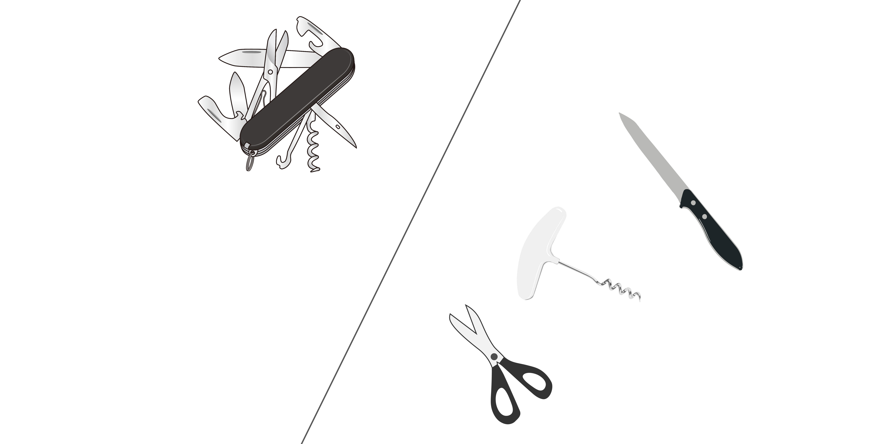

# SOLIDの原則とは
オブジェクト指向プログラミングにおけるソフトウェア"設計原則"の頭文字をとったもの。

+ 単一責任の原則(Single Responsibility Principle)
+ オープン/クロースドの原則(Open/closed principle)
+ リスコフの置換原則(Liskov substitution principle)
+ インターフェース分離の原則(Interface segregation principle)
+ 依存性逆転の原則(Dependency inversion principle)

# 単一責務の原則
クラスを変更する理由は1つ以上存在すべきでないという考え方。凝集とほぼ同義。オブジェクト指向におけるSoC。

単一責務の原則では、「役割（責務）＝変更理由」と定義され、変更理由が複数ある場合は役割が複数あるとみなされる。役割が複数あるクラスは分離して、凝集度を上げるべきである。

# オープン/クロースドの原則
ソフトウェアの構成要素（クラス、モジュール、関数など）は拡張に対して開いていて、修正に対して閉じているべきであるという考え方。

「拡張に対して開いていて、修正に対して閉じている」とは、容易にモジュールの振る舞いを拡張でき、振る舞いの拡張がモジュールに影響を与えない状態。

「抽象」を巧みに利用すれば、派生クラスを追加するだけで、既存のコードは変更しなくても、モジュールの振る舞いを修正できるようになる。

以下のデザインパターンは「オープン/クロースドの原則」に準ずるために利用される。
+ Strategyパターン
+ Template Methodパターン

# リスコフの置換原則
派生型はその基本型と置換可能であるべきという考え方。

「リスコフの置換原則」は「オープン/クロースドの原則」を実現するための主要原則。モジュールを修正せずに拡張する方法を、派生型とその基本型との置換可能性で表現する。派生型とその基本型とが置換可能であれば、派生型を追加するだけでモジュール修正せずに拡張することが可能になる。

クライアントは基本型のみに依存しており、派生型とその基本型とが置換可能であれば、派生型をいくら追加しても既存のモジュールに影響はない。

# インターフェース分離の原則
全てのインターフェースを1つのクラスに押し込むのではなく、関連性の高いインターフェースをグループ化して分離することで、クライアントが不要な機能に依存しなくてもよいようにすべきという考え方。

例として、距離メータと速度メータを実装するときを考える。

距離メータと速度メータは位置と時間に依存するため、位置・時間取得機能を利用すれば、実装できる。

ここで、実際には距離メータは時間に依存しないため、上図の設計ではインターフェース分離の原則に従っていないことになる。

そこで、インターフェース分離の原則に従い、位置取得機能と時間取得機能を分離すると、不要な依存関係を取り除ける。

# 依存性逆転の原則
依存関係に対して以下2点を提唱する考え方。
+ 上位のモジュールは下位のモジュールに依存してはならない。どちらのモジュールも抽象に依存すべきである。
+ 「抽象」は実装の詳細に依存してはならない。実装の詳細が「抽象」に依存すべきである。

従来の手続き型の開発手法では、ソフトウェアの方針が記述されている上位のモジュールが、実装の詳細が記述されているより下位のモジュールに依存するような構造になってしまう。

オブジェクト指向による開発手法では、依存関係を逆転し、下位のモジュールが上位モジュールに依存するように設計する。

上位レイヤに抽象インターフェースを宣言することで、上位モジュールはその抽象インターフェースを通してサービスを受け、下位モジュールで抽象インターフェースを実装する。（上位モジュールは抽象インターフェースを通して下位モジュールを利用することになる）

これによって、上位モジュールと下位モジュールはともに抽象インターフェースに依存することになる。
