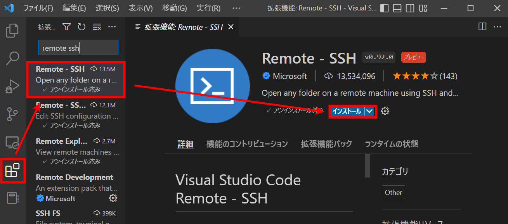
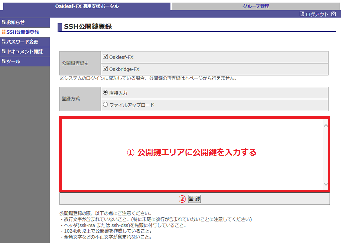
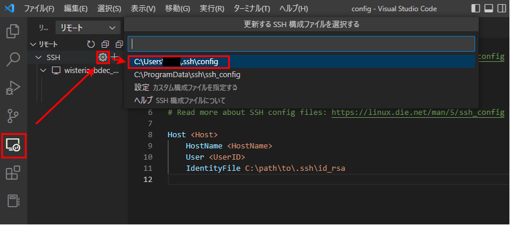
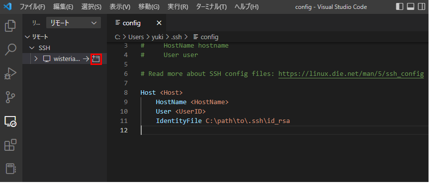

# SSHとは
Secure Shellの略。安全にリモート接続するための仕組み。

# VSCodeでリモート環境にSSH接続する
以下の手順に従って、VSCodeからリモート環境にSSH接続する。

1. VSCodeの拡張機能"Remote-SSH"をインストールする



2. 任意の場所に.sshディレクトリを作成後、以下のコマンドを実行し、秘密鍵と公開鍵を作成する
```
cd .ssh
ssh-keygen -t rsa -f id_rsa
```

パスフレーズの入力が求められるので、英数字が混在した10~30文字の文字列を入力する。

```
Enter passphrase (empty for no passphrase):
Enter same passphrase again:
```

パスフレーズを入力するとランダムアートが表示され、.sshディレクトリ内に秘密鍵(id_rsa)と公開鍵(id_rsa.pub)が作成される。

```
The key's randomart image is:
+---[RSA 3072]----+
|         .*@#XE. |
|         +oB++.o |
|          O B .  |
|         * = =   |
|      o S B o    |
|     o o O . .   |
|    . . . + .    |
|   . o     o     |
|    o            |
+----[SHA256]-----+
```

3. 以下のコマンドを実行し、公開鍵の内容を確認する

(Windowsの場合)
```
type id_rsa.pub 
```

(Linuxの場合)
```
cat id_rsa.pub
```

公開鍵の内容が表示されるのでクリップボードにコピーする。コピーの際はssh-rsaの部分も含める。

```
ssh-rsa ADcX...

```

4. ポータルなどにクリップボードにコピーした公開鍵の内容を貼り付けて、登録する


出典：https://www.cc.u-tokyo.ac.jp/supercomputer/fx10/fx10-tebiki/chapter4.html

5. VSCodeの.ssh/configファイルに認証情報を追加する



.ssh/config
```
Host <Host>
    HostName <HostName>
    User <UserID>
    IdentityFile C:\path\to\.ssh\id_rsa
```

6. VSCodeでSSH接続を実施する


