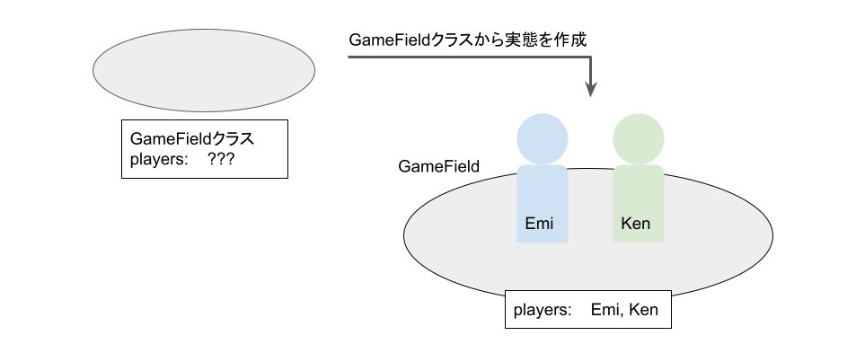

# Strategyパターンとは
Strategyパターンでは戦略（アルゴリズム）の部分をクラスとして抽出し、容易に戦略の切り替えができる。

## 実装例
Strategyパターンの実装例として、「じゃんけんプログラム」をみてみよう。

「じゃんけんプログラム」の機能要件は以下とする。

+ EmiとKenがじゃんけんを実施
+ Emiはグーしか出さない
+ Kenはランダムに出す
+ 勝敗を画面上に出力する

「じゃんけんプログラム」では、Strategyクラスを継承したConstantStrategyクラスとRandomStrategyクラスを具体的な戦略クラスとして抽出している。そして、戦略クラスを集約しているPlayerクラスと、Playerクラスを管理するGameFieldクラスを実装する。

「じゃんけんプログラム」のクラス図、処理順序と処理イメージ、コードで表現したものを以下に示す。

+ クラス図


+ 処理順序と処理イメージ

① PlayerクラスからEmiとKenを作成


② GameFieldクラスからEmiとKenを配置したGameFieldを作成



③ GameFieldクラスのfightメソッドでじゃんけんを実施


+ コード（Python）      ※ わかりやすさを優先して実装部分は省略

```
# Playerクラスを定義
class Player():
    ...(実装部分は省略)

# Strategyクラスを定義
class Strategy():
    ...(実装部分は省略)

# ConstantStrategyクラスを定義
class ConstantStrategy(Strategy):
    ...(実装部分は省略)

# RandomStrategyクラスを定義
class RandomStrategy(Strategy):
    ...(実装部分は省略)

# GameFieldクラス定義
class GameField():
    ...(実装部分は省略)

# プレイヤーEmiを作成
emi = Player(name='Emi', strategy=ConstantStrategy('Goo'))

# プレイヤーKenを作成
ken = Player(name='Ken', strategy=RandomStrategy())

# EmiとKenを配置したGameFieldを作成
game = GameField(players=[emi, ken])

# じゃんけんを実施
game.fight()
```

今回の例では、「じゃんけんプログラム」の戦略としてConstantStrategyクラスとRandomStrategyクラスしか実装していないが、新たにクラスを作ることで戦略の追加、変更が容易にできる。

最後に、「実装部分を省略していないコード」も記載しておくので、余裕があれば参照されたい。

・コード（Python） ※ 実装部分を省略していないコード

```
# Python 3.6.10で動作確認済み

import random

# Playerクラスを定義
class Player():
    def __init__(self, name, strategy):
        self.name = name
        self.strategy = strategy

    def next_hand(self):
        return self.strategy.next_hand()

# Strategyクラスを定義
class Strategy():
    def next_hand(self):
        pass

# ConstantStrategyクラスを定義
class ConstantStrategy(Strategy):
    def __init__(self, hand):
        self.hand = hand
    
    def next_hand(self):
        return self.hand

# RandomStrategyクラスを定義
class RandomStrategy(Strategy):
    def next_hand(self):
        hand = random.choice(&#91;'Goo','Choki','Par'])
        return hand

# GameFieldクラスを定義
class GameField():
    def __init__(self, players):
        self.players = players
        
    def fight(self):
        # フィールドを定義
        self.field = {}
        for player in self.players:
            self.field&#91;player.name] = player.next_hand()
            
        # 勝敗判定メソッド呼び出し
        self.__judge(self.field)

    def __judge(self, field):
        # フィールド上の手を格納
        hands = set(field.values())
    
        # 全員が同じ手の場合 → あいこ
        if len(hands)==1:
            for player, hand in field.items():
                print(f'{player}: {hand}    &lt;Draw&gt;')
        
        # 場にグー、チョキ、パーの内2種類の手がある場合 → 勝敗判定
        elif len(hands)==2:
            strong_hand = self.__get_strong_hand(set(field.values()))
            

            # 勝敗判定
            judgements = &#91;'Win' if hand==strong_hand else 'Lose' \
                                for hand in field.values()]
            for (player, hand), judgement in zip(field.items(), judgements):
                print(f'{player}: {hand}    &lt;{judgement}&gt;')
            
        # 場にグー、チョキ、パーのすべての手がある場合 → あいこ
        elif len(hands)==3:
            for player, hand in field.items():
                print(f'{player}: {hand}    &lt;Draw&gt;')
        
    def __get_strong_hand(self, hands):
        # フィールド上の手がグーとチョキ → グーの勝ち
        if hands==set(&#91;'Goo','Choki']):
            return 'Goo'
        # フィールド上の手がチョキとパー → チョキの勝ち
        elif hands==set(&#91;'Choki','Par']):
            return 'Choki'
        # フィールド上の手がグーとパー → パーの勝ち
        elif hands==set(&#91;'Goo','Par']):
            return 'Par'

# プレイヤーEmiを作成
emi = Player(name='Emi', strategy=ConstantStrategy('Goo'))

# プレイヤーKenを作成
ken = Player(name='Ken', strategy=RandomStrategy())

# EmiとKenを配置したGameFieldを作成
game = GameField(players=&#91;emi, ken])

# じゃんけんを実施
game.fight()

# Emi: Goo    &lt;Win&gt;
# Ken: Choki    &lt;Lose&gt;
```