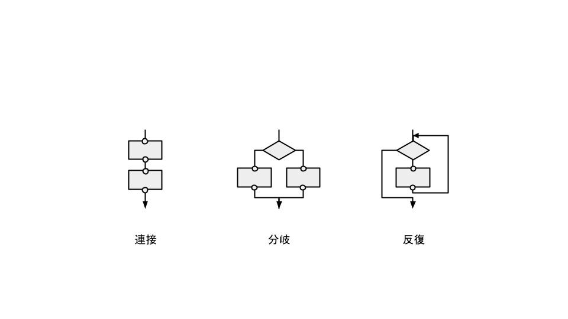
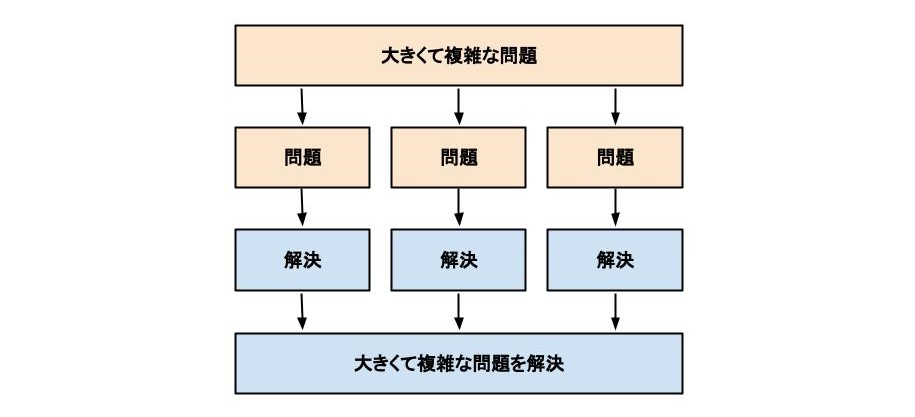

# 構造化プログラミングとは
制御構造を連接、分岐、反復の3つだけに制限し、その組み合わせによってコードを記述する手法。コードは「手続き」という単位で記述され、分割統治法に基づいて階層構造に整理される。

「手続き」という単位で記述する点に関しては「手続き型プログラミング」と同じ。

「構造化定理」と「分割統治法」を基盤としている。

# 構造化定理
全てのアルゴリズムは、連接、分岐、反復の3つの基本制御構造の組み合わせで記述できることを示す定理。
コラド・ベームとジュゼッペ・ヤコピーニによって数学的に証明された。ベーム-ヤコピーニの定理とも呼ばれる。

# 分割統治法
大きくて複雑な問題を、簡単に解けるサイズにまで分割し、分割された問題を個別に解くことによって効率的に解決策を得ようとする手法。

