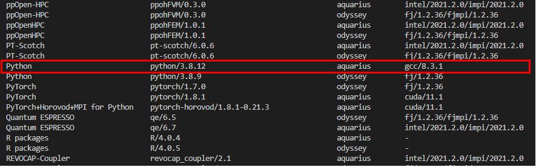

# スーパーコンピュータでサンプルプログラムを動かす
以下の手順で、Pythonで書かれたサンプルプログラムをスーパーコンピュータ(Wisteria)上で動かす。

1. workディレクトリ配下に移動して、sampleディレクトリを作成する

```
cd /work/<プロジェクトコード>/<ユーザーID>
mkdir sample
```

2. 以下のコマンドを実行して、Python環境作成に必要なモジュールを確認する

```
show_module
```



今回はgcc/8.3.1とpython/3.8.12モジュール環境を利用する。

3. 以下のコマンドを実行して、Python3.8.12を利用できるようにする
```
module load gcc/8.3.1
module load python/3.8.12
```

4. 以下のコマンドを実行して、読み込んだモジュールを確認する
```
module list
```

出力
```
Currently Loaded Modulefiles:
 1) gcc/8.3.1(default)   2) python/3.8.12
```

モジュールを消去したい場合は"module purge"を使う。
```
module purge
module list
```

出力
```
No Modulefiles Currently Loaded.
```

■ moduleコマンドのオプション

|オプション|内容|
|-|-|
|avail|利用可能な環境の一覧を表示|
|list|現在ロードしている環境一覧を表示|
|load|指定した環境のロード|
|unload|指定した環境のアンロード|
|switch|環境のロードとアンロードを同時に実行|
|purge|環境をすべてアンロード|

出典：https://www.cc.u-tokyo.ac.jp/events/lectures/163/tut163_1st_putty.pdf

5. 以下のコマンドを実行し、仮想環境を作成、起動する
```
cd sample
python3 -mvenv venv
source venv/bin/activate
```

6. 以下のコマンドを実行し、PytorchとPandasをインストールする
```
pip3 install --upgrade pip setuptools
pip3 install torch==1.8.1+cu111 torchvision==0.9.1+cu111 torchaudio===0.8.1 -f https://download.pytorch.org/whl/torch_stable.html
pip3 install pandas
```

7. sampleディレクトリ直下に、pytorch.pyとpytorch.shを作成する

pytorch.py
```
try:
    import torch
    device = torch.device("cuda:0" if torch.cuda.is_available() else "cpu")
    print(f'PyTorch Success!')
    print(f'Device: "{device}"')
except Exception as e:
    print(f"Error: {e}")
    
try:
    import pandas
    print("Pandas Success!")
except Exception as e:
    print(f"Error: {e}")
```

pytorch.sh
```
#!/bin/sh
#PJM -L rscgrp=share-debug
#PJM -L gpu=1
#PJM -L elapse=0:10:00
#PJM -g <プロジェクトコード>
#PJM -j

module load gcc/8.3.1
module load python/3.8.12
source venv/bin/activate
python3 pytorch.py
```

プロジェクトコードについては各自割り当てられたものを記入する。また、ジョブクラスには"share-debug"を指定した。使用可能なジョブクラスについては以下のリンクを参照。  
https://www.cc.u-tokyo.ac.jp/supercomputer/wisteria/service/job.php

8. 以下のコマンドを実行し、サンプルプログラムジョブを投げる

```
pjsub pytorch.sh
```

■ ジョブ管理コマンド

|オプション|内容|
|-|-|
|pjsub|ジョブの投入|
|pjdel|ジョブの削除|
|pjstat|ジョブの状態|

出典：https://www.cc.u-tokyo.ac.jp/events/lectures/163/tut163_1st_putty.pdf

pjsubなどのコマンドは富士通独自のもので、使用するスーパーコンピュータによって異なる。

9. 出力ファイルを確認する

Inportエラーが発生しておらず、GPU(Cuda)の読み込みができていることを確認する。

```
PyTorch Success!
Device: "cuda:0"
Pandas Success!
```

# 参考資料
+ https://www.cc.u-tokyo.ac.jp/events/lectures/163/index.php#lecture-ppt