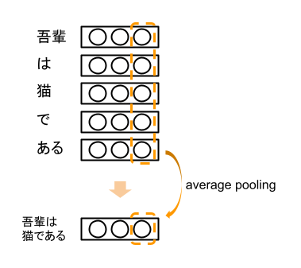
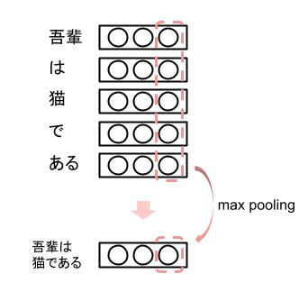
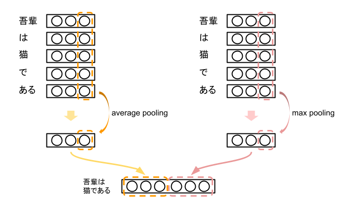
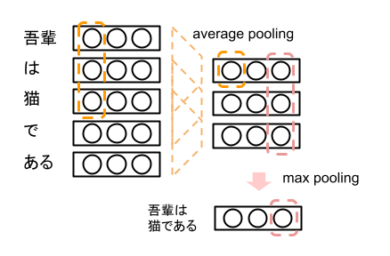

# SWEMとは
SWEMは、対象の文章が構成する単語のベクトル表現から文章のベクトル表現を得る最も単純なものの一つ。SWEMには"aver"、"max"、"concat"、"hier"の4つの種類がある。

# SWEM-aver
SWEM-averでは文章を構成する単語の平均をとり（average pooling）文章ベクトルを作成する。

# SWEM-max
SWEM-maxでは文章を構成する単語の最大値をとり（max pooling）文章ベクトルを作成する。

# SWEM-concat
SWEM-concatではSWEM-averとSWEM-maxを合わせて文章ベクトルを作成する。

# SWEM-hier
SWEM-heirでは、n-gramのように固定長のウィンドウで平均をとり（average pooling）、その結果に対して最大値を取る（max pooling）。

