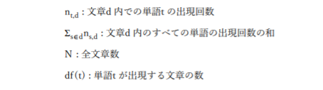

# TF-IDFとは
TF-IDFは、TF(Term Frequency)とIDF(Inverse Document Frequency)を用いて単語を重み付けする手法。

TFは同じ文章内での出現頻度が高い単語ほど重みが大きくなるように、IDFは他の文章中での出現頻度が低い単語ほど重み大きくなるように調整する役割を担う。

TF-IDFによる各文章d 中の単語tの重みは、以下の式で表される。

$$
tfidf(t,d) = tf(t,d) x idf(t)
$$

tf(t,d)は文章d の内の単語tの出現率、idf(t)は単語tが出現する文章の割合の逆数であり、以下の式で表される。

$$
tf(t, d) = \frac{n_{t,d}}{\sum_{s \in d} n_{s,d}}
$$
$$
idf(t) = log \frac{N}{df(t)}
$$

なお、scikit-learnでの<em>idf(t)</em>の定義は若干異なっている。

smooth_idf=Falseの場合、

$$
idf(t) = log \frac{N}{df(t)} + 1
$$

smooth_idf=Trueの場合、

$$
idf(t) = log \frac{N+1}{df(t)+1} + 1
$$
