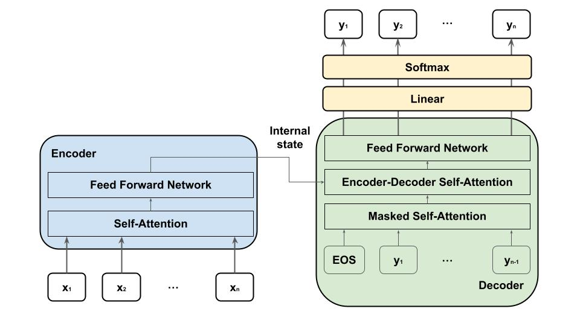

# Transformerとは
Transformerはseq2seqから発展したモデルで、seq2seqと同じくEncoder-Decoderモデルである。TransformerではRNNを使用せず、Self-Attentionだけを用いて構築する。そのため、単語の順番に沿って計算する必要が無く並列化による高速化処理が可能である。Decoder側では、予測ターゲットの情報がリークしないようにMasked-Self-Attentionを用いる。

