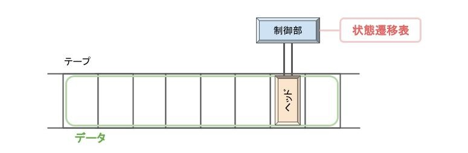
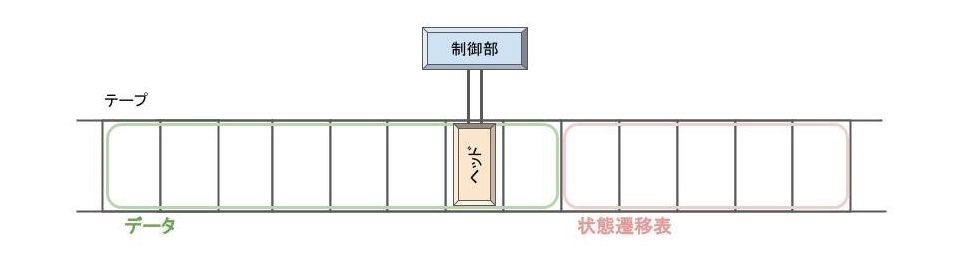

# チューリングマシンとは
最も単純化されたコンピュータのモデル。あらゆるアルゴリズムがチューリングマシンで実行できる。

チューリングマシンはテープ、ヘッド、制御部から構成され、それぞれ以下の役割を担う。
+ テープ：記号の記録
+ ヘッド：テープへの読み書きや、テープ上の移動
+ 制御部：状態遷移表（プログラムに対応）に従って、ヘッドにテープへの読み書きやテープ上の移動を指示

かつて計算は人が紙とペンを用いて行っていたが、
テープ、ヘッド、制御部のみの単純な構成に制限しても、計算能力は失われないことが示された。
テープがメモリに、ヘッドと制御部がCPUに対応する。

# 万能チューリングマシン
任意のチューリングマシンの動きを再現できるチューリングマシン。
状態遷移表(プラグラム)をデータと同一視してテープに記録することで実装できる。

現代のコンピュータは、万能チューリングマシンの原理に基づいて、メモリとCPUから構成されるコンピュータ（ノイマン型コンピュータ）である。

万能チューリングマシンと同じ計算能力をもつ計算モデルはチューリング完全という。

# 計算可能性について
チャーチ・チューリングの提唱によって「万能チューリングマシン以上の計算能力をもつ計算モデルが存在しないため、チューリングマシンの計算可能性を計算可能性の定義なのだろう」と提唱されている。