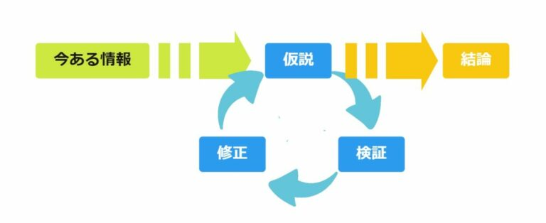
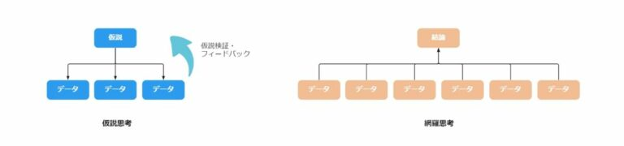
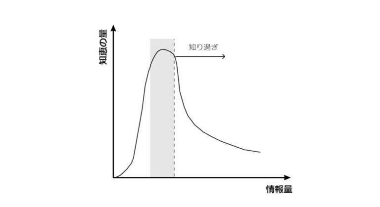
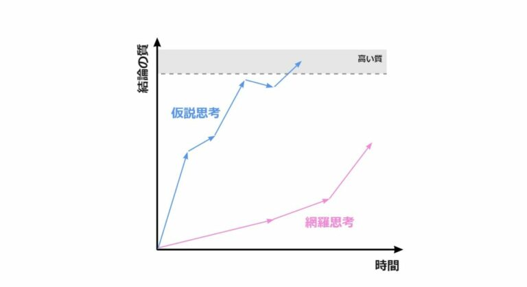

# 記事の内容
本記事では仮説思考とはなにか、なぜ必要なのかについて解説します。

# 仮説思考とは何か
仮説思考とは、限られた情報の中から仮説を立て、検証、修正のサイクルを回すことによって、結論の質を上げていこうとする思考プロセスです。仮説検証のサイクルを小さく回し、仮説の精度を上げていくことで、短期間で効率的に結論に到達できます。

対して、一般に企業は、考えうるさまざまな局面から調査・分析を実施してから意思決定しようとする傾向があります。このように、できるだけ多くの情報を集めて完璧な結論を出そうとする思考プロセスを網羅思考と呼びます。

仮説思考では仮説を基に検証に必要なデータのみを集めますが、網羅思考ではありとあらゆるデータを集め、そこから絶対的な結論を導こうとします。

# なぜ失敗するのか
変化の激しい現代社会で網羅思考でアプローチした場合、意思決定に時間がかかりすぎて施策の実施が遅れたり、次々と新しい情報が出てきていつまでも意思決定できない状態に陥りかねません。そうこうしているうちに、売上が下がり続けて、取り返しがつかなくなってしまうかもしれません。

より深刻な問題は、情報を集めすぎて自分ならではの視点が失われて新しい知恵が出てこなくなることです。ある程度までは情報を集めることで働く知恵の量が大きくなりますが、ある量を超えると働く知恵の量が減衰していきます。

例えば、一流のベテラン科学者が、若いときのような革新的なアイデアが生み出せなくなるなどがあります。

# なぜ仮説思考が必要なのか
前述の通り、仮説思考とは、限られた情報の中から仮説を立て、検証、修正のサイクルを回すことによって、問題解決に向けて進んでいく思考法です。

仮説思考には以下のようなメリットがあります。

+ 本当に取り組むべき価値のある問題かどうかを見極められる
+ 必要な情報と分析するべきことが明確になる
+ 分析結果の解釈が明確になる

## 「本当に取り組むべき価値のある問題」かどうかを見極められる
仮説思考によって、「本当に取り組むべき価値のある問題」かどうかを見極められるようになります。

世の中で「問題かもしれない」と言われていることのうち、「本当に取り組むべき価値のある問題」はほんのわずかしかありません。ほとんどの問題は、解いてもその後の意思決定に全く影響しないか大したインパクトのない問題か、あるいは複雑すぎてそもそも解くことのできない問題です。

具体的な仮説を立てることで、ストーリーが明確になり、次の意思決定に影響する「本当に取り組むべき価値のある問題」かどうかの見極められるようになります。

例えば「売上が下がっているのはなぜか」という問いを考えます。「向かい側に競合店がオープンしたため客足が減った」という仮説を立てても、店を移設できないなら次の施策につながりません。一方で、「テイクアウトの客足は変わらない」という仮説を立てた場合、テイクアウトに力を入れるなど次の施策につなげることができます。この場合、後者が「本当に取り組むべき価値のある問題」ということになります。

ホームビジネス
なぜ仮説思考が必要なのか？
記事の内容
本記事では仮説思考とはなにか、なぜ必要なのかについて解説します。

仮説思考とは何か
仮説思考とは、限られた情報の中から仮説を立て、検証、修正のサイクルを回すことによって、結論の質を上げていこうとする思考プロセスです。仮説検証のサイクルを小さく回し、仮説の精度を上げていくことで、短期間で効率的に結論に到達できます。

仮説思考の全体像
対して、一般に企業は、考えうるさまざまな局面から調査・分析を実施してから意思決定しようとする傾向があります。このように、できるだけ多くの情報を集めて完璧な結論を出そうとする思考プロセスを網羅思考と呼びます。

仮説思考では仮説を基に検証に必要なデータのみを集めますが、網羅思考ではありとあらゆるデータを集め、そこから絶対的な結論を導こうとします。

仮説思考と網羅思考
なぜ失敗するのか
変化の激しい現代社会で網羅思考でアプローチした場合、意思決定に時間がかかりすぎて施策の実施が遅れたり、次々と新しい情報が出てきていつまでも意思決定できない状態に陥りかねません。そうこうしているうちに、売上が下がり続けて、取り返しがつかなくなってしまうかもしれません。

より深刻な問題は、情報を集めすぎて自分ならではの視点が失われて新しい知恵が出てこなくなることです。ある程度までは情報を集めることで働く知恵の量が大きくなりますが、ある量を超えると働く知恵の量が減衰していきます。

例えば、一流のベテラン科学者が、若いときのような革新的なアイデアが生み出せなくなるなどがあります。

情報量と知恵の量
（イシューからはじめよ[*1]より抜粋）
なぜ仮説思考が必要なのか
前述の通り、仮説思考とは、限られた情報の中から仮説を立て、検証、修正のサイクルを回すことによって、問題解決に向けて進んでいく思考法です。

仮説思考には以下のようなメリットがあります。

+ 本当に取り組むべき価値のある問題かどうかを見極められる
+ 必要な情報と分析するべきことが明確になる
+ 分析結果の解釈が明確になる

## 「本当に取り組むべき価値のある問題」かどうかを見極められる
仮説思考によって、「本当に取り組むべき価値のある問題」かどうかを見極められるようになります。

世の中で「問題かもしれない」と言われていることのうち、「本当に取り組むべき価値のある問題」はほんのわずかしかありません。ほとんどの問題は、解いてもその後の意思決定に全く影響しないか大したインパクトのない問題か、あるいは複雑すぎてそもそも解くことのできない問題です。

具体的な仮説を立てることで、ストーリーが明確になり、次の意思決定に影響する「本当に取り組むべき価値のある問題」かどうかの見極められるようになります。

例えば「売上が下がっているのはなぜか」という問いを考えます。「向かい側に競合店がオープンしたため客足が減った」という仮説を立てても、店を移設できないなら次の施策につながりません。一方で、「テイクアウトの客足は変わらない」という仮説を立てた場合、テイクアウトに力を入れるなど次の施策につなげることができます。この場合、後者が「本当に取り組むべき価値のある問題」ということになります。

## 必要な情報と分析するべきことが明確になる
仮説思考によって、必要な情報と分析するべきことが明確になります。

仮説を立てない限り、解こうとしている問題に関係ありそうな情報を網羅的に集めることになってしまいます。「新しい会計基準について調べておいて」と言われた場合、どこまで調べればよいかわからず、無駄に詳細まで調べてしまうことになりかねません。

具体的な仮説を立てることで、本当は必要ない情報を集めている無駄な時間を大幅に削減できます。「新しい会計基準ではわが社の利益が大きく下がるのではないか」と言われた場合、どこまで調べればよいかがより明確になり、無駄な作業を大きく削減できます。

## 分析結果の解釈が明確になる
仮説思考によって、分析結果の解釈が明確になります。

仮説を立てない限り、あらゆる角度から網羅的に分析することになります。分析した結果には、当たり前のことやアクションにつながらない分析結果も多分に含まれることになります。

具体的な仮説を立て、何のための分析かを明確にすることによって、「結論は出たけどそれって当たり前だよね。」とか「分析結果は出たけど結局何をすればいいんだっけ？」といった結末を防ぐことができます。

## 仮説思考では短期間で効率的に結論に到達できる
前述の通り、仮説思考は網羅思考と比較して、短期間で効率的に結論にたどり着くことができます。仮説が間違っていたとしても、気づいた時点で新しい仮説を立てれば良く、仮説検証のサイクルを回していくに連れて結論の質も向上していきます。

（「イシューからはじめよ」より抜粋）

# まとめ
仮説思考とはなにか、仮説思考の3つのメリットと有効性を網羅思考と対比させながら解説しました。

仮説思考は網羅思考と比較して短期間で効率的に結論に到達できるという点で優れており、3つのメリットを具体例を交えてみていきました。

# 参考資料
1. イシューからはじめよー知的生産の「シンプルな本質」 安宅和人 英治出版
1. 仮説思考 BCG流 問題発見・解決の発想法 内田和成 東洋経済新報社
