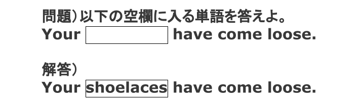
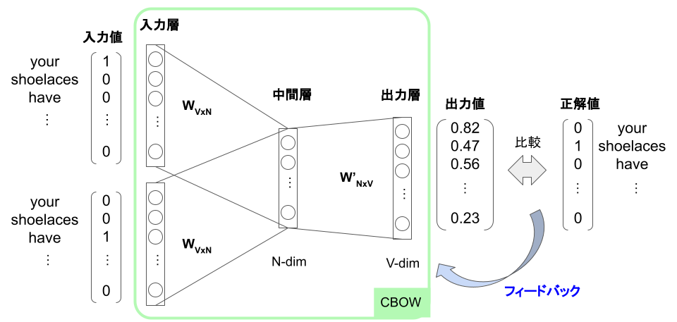
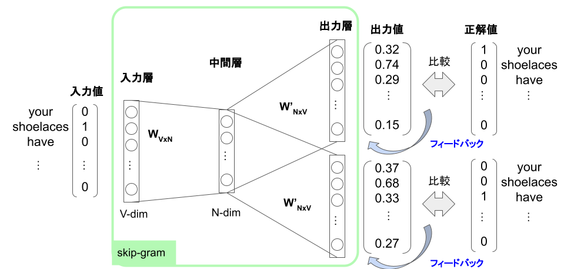

# Word2Vecとは
Word2Vecはニューラルネットワークを用いた単語ベクトル化手法である。

Word2Vecによる単語ベクトル化手法では、ある偽のタスクを解かせることで3層のニューラルネットワークを学習し、学習後の重みを単語ベクトルとして取り出して利用する。偽のタスクとは「ある単語が与えられたときその周辺の単語を予測する」タスクで、ニューラルネットワークは下記のような穴埋め問題を解くことで文脈から単語の意味を学習する。

Word2Vecには「CBOW」と「skip-gram」の2種類あり、解いているタスクがわずかに異なっている。

# CBOW
COBWでは「前後の単語からその中間の単語を予測する」というタスクを解く。

入力値として前後の単語（your, have）をOne-hotベクトル化したものを、正解値として中間の単語（shoelaces）をOne-hotベクトル化したものを使用する。今回の例ではウィンドウサイズが1（前後合わせて2単語）のため、入力層は2つになっているが、ウィンドウサイズが大きくなると、その分入力層の数も大きくなる。

実際には、大量の文章から入力値と正解値の組を作り、フィードバックをかけながらモデル内の重みを更新していく。更新を続けることで、「前後の単語からその中間の単語を予測する」という偽のタスクを解けるようにモデルを学習する。このモデルは単語間の関係を学習しており、モデルの重みWVxNは単語ベクトルとして利用できる。

# skip-gram
skip-gramでは「中間の単語から前後の単語を予測する」というタスクを解く。

入力値として中間の単語（shoelaces）をOne-hotベクトル化したものを、正解値として前後の単語（your, have）をOne-hotベクトル化したものを使用する。今回の例ではウィンドウサイズが1（前後合わせて2単語）のため、出力層は2つになっているが、ウィンドウサイズが大きくなると、その分出力層の数も大きくなる。

実際には、大量の文章から入力値と正解値の組を作り、フィードバックをかけながらモデル内の重みを更新していく。更新を続けることで、「中間の単語から前後の単語を予測する」という偽のタスクを解けるようにモデルを学習する。このモデルは単語間の関係を学習しており、モデルの重みWVxNは単語ベクトルとして利用できる。