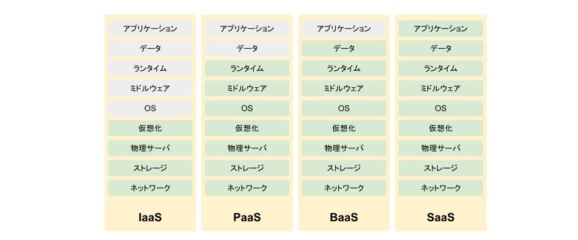

# XaaSとは
X as a Serviceの略。Xを提供するクラウドサービス。IaaS、PaaS、BaaS、SaaSに大別される。

# IaaSとは
Infrastructure as a Serviceの略。ITシステム基盤（インフラ）を提供するサービス。
Amazon EC2など。

# PaaSとは
Platform as a Serviceの略。アプリケーション構築のためのプラットフォームを提供するサービス。AWS LambdaやAmazon S3など。

# BaaSとは
Backend as a Serviceの略。バックエンド機能を提供するサービス。Firebaseなど。

# SaaSとは
Software as a Serviceの略。ソフトウェアを提供するサービス。Microsoft Office、Dropbox、Slack、freeeなど。
